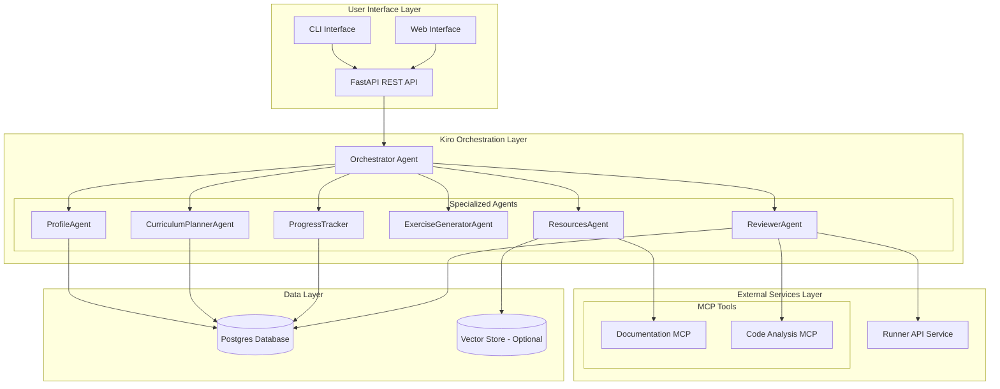

# Design Document: Agentic Learning Coach for Developers

## Overview

The Agentic Learning Coach is a sophisticated multi-agent system built on Kiro's orchestration framework that provides personalized, adaptive coding education. The system combines specialized AI agents, MCP tool integration, secure code execution, and persistent data storage to deliver a comprehensive learning experience.

The architecture follows clean separation of concerns with domain-driven design principles, ensuring maintainability and scalability. Each agent has a specific responsibility within the learning ecosystem, coordinated by an orchestrator that manages complex workflows and inter-agent communication.

## Architecture

### System Architecture Diagram



### Multi-Agent Orchestration Pattern

The system implements a **Hub-and-Spoke** orchestration pattern where the Orchestrator serves as the central coordinator, routing requests to specialized agents based on intent classification. This pattern provides:

- **Clear separation of concerns**: Each agent has a single, well-defined responsibility
- **Scalable coordination**: New agents can be added without modifying existing ones
- **Fault isolation**: Agent failures don't cascade to other components
- **Flexible workflows**: Complex multi-step processes can be composed dynamically

## Components and Interfaces

### Core Agent Interfaces

```python
from abc import ABC, abstractmethod
from typing import Any, Dict, Optional
from dataclasses import dataclass
from enum import Enum

class AgentType(Enum):
    ORCHESTRATOR = "orchestrator"
    PROFILE = "profile"
    CURRICULUM_PLANNER = "curriculum_planner"
    RESOURCES = "resources"
    EXERCISE_GENERATOR = "exercise_generator"
    REVIEWER = "reviewer"
    PROGRESS_TRACKER = "progress_tracker"

@dataclass
class LearningContext:
    user_id: str
    session_id: str
    current_objective: Optional[str] = None
    skill_level: Optional[str] = None
    learning_goals: list[str] = None
    time_constraints: Optional[Dict[str, Any]] = None
    correlation_id: Optional[str] = None

@dataclass
class AgentResult:
    success: bool
    data: Optional[Any] = None
    error: Optional[str] = None
    next_actions: list[str] = None

class BaseAgent(ABC):
    """Base interface for all learning coach agents"""
    
    @abstractmethod
    async def process(self, context: LearningContext, payload: Dict[str, Any]) -> AgentResult:
        """Process a request within the given learning context"""
        pass
    
    @abstractmethod
    def get_supported_intents(self) -> list[str]:
        """Return list of intents this agent can handle"""
        pass
```

### Orchestrator Agent

The Orchestrator implements the central coordination logic:

```python
class OrchestratorAgent(BaseAgent):
    def __init__(self, agent_registry: Dict[AgentType, BaseAgent]):
        self.agents = agent_registry
        self.intent_router = IntentRouter()
    
    async def process(self, context: LearningContext, payload: Dict[str, Any]) -> AgentResult:
        intent = self.intent_router.classify_intent(payload.get('message', ''))
        target_agent = self.intent_router.route_to_agent(intent)
        
        if target_agent not in self.agents:
            return AgentResult(success=False, error=f"Agent {target_agent} not available")
        
        # Execute with circuit breaker and timeout
        try:
            result = await asyncio.wait_for(
                self.agents[target_agent].process(context, payload),
                timeout=30.0
            )
            return result
        except asyncio.TimeoutError:
            return await self._handle_timeout(target_agent, context, payload)
```

### ProfileAgent Implementation

```python
class ProfileAgent(BaseAgent):
    def __init__(self, user_repository: UserRepository):
        self.user_repo = user_repository
    
    async def process(self, context: LearningContext, payload: Dict[str, Any]) -> AgentResult:
        intent = payload.get('intent')
        
        if intent == 'assess_skill_level':
            return await self._conduct_assessment(context, payload)
        elif intent == 'update_goals':
            return await self._update_learning_goals(context, payload)
        elif intent == 'set_constraints':
            return await self._set_time_constraints(context, payload)
        
        return AgentResult(success=False, error="Unsupported intent")
    
    async def _conduct_assessment(self, context: LearningContext, payload: Dict[str, Any]) -> AgentResult:
        # Implement diagnostic question logic
        questions = self._generate_diagnostic_questions(payload.get('domain'))
        
        if 'responses' in payload:
            skill_level = self._evaluate_responses(payload['responses'])
            await self.user_repo.update_skill_level(context.user_id, skill_level)
            return AgentResult(success=True, data={'skill_level': skill_level})
        
        return AgentResult(success=True, data={'questions': questions})
```

### CurriculumPlannerAgent Implementation

```python
class CurriculumPlannerAgent(BaseAgent):
    def __init__(self, curriculum_repository: CurriculumRepository):
        self.curriculum_repo = curriculum_repository
        self.curriculum_patterns = CurriculumPatterns()
    
    async def process(self, context: LearningContext, payload: Dict[str, Any]) -> AgentResult:
        intent = payload.get('intent')
        
        if intent == 'create_learning_path':
            return await self._create_curriculum(context, payload)
        elif intent == 'adapt_difficulty':
            return await self._adapt_curriculum(context, payload)
        
        return AgentResult(success=False, error="Unsupported intent")
    
    async def _create_curriculum(self, context: LearningContext, payload: Dict[str, Any]) -> AgentResult:
        user_profile = payload.get('user_profile')
        goals = payload.get('goals', [])
        
        # Apply curriculum design patterns
        modules = self.curriculum_patterns.design_progressive_modules(
            goals=goals,
            skill_level=user_profile.get('skill_level'),
            time_constraints=user_profile.get('time_constraints')
        )
        
        # Create learning plan
        plan = LearningPlan(
            user_id=context.user_id,
            title=f"Learning Path: {', '.join(goals)}",
            modules=modules,
            total_days=self._calculate_duration(modules, user_profile)
        )
        
        saved_plan = await self.curriculum_repo.save_plan(plan)
        return AgentResult(success=True, data=saved_plan.to_dict())
```

## Data Models

### Domain Entities

```python
from dataclasses import dataclass
from datetime import datetime
from typing import List, Optional, Dict, Any
from enum import Enum

class SkillLevel(Enum):
    BEGINNER = "beginner"
    INTERMEDIATE = "intermediate"
    ADVANCED = "advanced"
    EXPERT = "expert"

class TaskType(Enum):
    READ = "READ"
    WATCH = "WATCH"
    CODE = "CODE"
    QUIZ = "QUIZ"

@dataclass
class UserProfile:
    id: str
    user_id: str
    skill_level: SkillLevel
    learning_goals: List[str]
    time_constraints: Dict[str, Any]
    preferences: Dict[str, Any]
    created_at: datetime
    updated_at: datetime

@dataclass
class LearningPlan:
    id: str
    user_id: str
    title: str
    goal_description: str
    total_days: int
    status: str
    modules: List['Module']
    created_at: datetime

@dataclass
class Module:
    id: str
    plan_id: str
    title: str
    order_index: int
    summary: str
    tasks: List['Task']

@dataclass
class Task:
    id: str
    module_id: str
    day_offset: int
    task_type: TaskType
    description: str
    estimated_minutes: int
    resources: List[Dict[str, Any]]
    completion_criteria: str

@dataclass
class Submission:
    id: str
    task_id: str
    user_id: str
    code_content: Optional[str]
    repository_url: Optional[str]
    submitted_at: datetime

@dataclass
class EvaluationResult:
    id: str
    submission_id: str
    status: str  # PASS, FAIL, PARTIAL
    test_output: Dict[str, Any]
    static_feedback: Optional[Dict[str, Any]]
    score: float
    feedback_message: str
    evaluated_at: datetime
```

### Repository Interfaces

```python
from abc import ABC, abstractmethod
from typing import List, Optional

class UserRepository(ABC):
    @abstractmethod
    async def create_user(self, email: str, name: str) -> UserProfile:
        pass
    
    @abstractmethod
    async def get_user_profile(self, user_id: str) -> Optional[UserProfile]:
        pass
    
    @abstractmethod
    async def update_skill_level(self, user_id: str, skill_level: SkillLevel) -> None:
        pass

class CurriculumRepository(ABC):
    @abstractmethod
    async def save_plan(self, plan: LearningPlan) -> LearningPlan:
        pass
    
    @abstractmethod
    async def get_active_plan(self, user_id: str) -> Optional[LearningPlan]:
        pass
    
    @abstractmethod
    async def get_tasks_for_day(self, user_id: str, day_offset: int) -> List[Task]:
        pass

class SubmissionRepository(ABC):
    @abstractmethod
    async def save_submission(self, submission: Submission) -> Submission:
        pass
    
    @abstractmethod
    async def save_evaluation(self, evaluation: EvaluationResult) -> EvaluationResult:
        pass
```

## MCP Tool Integration

### Resource Discovery MCP

```python
from typing import List, Dict, Any
import httpx

class DocumentationMCP:
    """MCP tool for discovering and retrieving learning resources"""
    
    def __init__(self, base_urls: Dict[str, str]):
        self.base_urls = base_urls  # e.g., {'react': 'https://react.dev', 'fastapi': 'https://fastapi.tiangolo.com'}
        self.client = httpx.AsyncClient()
    
    async def search_documentation(self, technology: str, topic: str) -> List[Dict[str, Any]]:
        """Search official documentation for specific topics"""
        if technology not in self.base_urls:
            return []
        
        # Implement documentation scraping/API calls
        base_url = self.base_urls[technology]
        search_results = await self._search_docs(base_url, topic)
        
        return [
            {
                'title': result['title'],
                'url': result['url'],
                'summary': result['summary'],
                'relevance_score': result['score'],
                'source': 'official_docs'
            }
            for result in search_results
        ]
    
    async def get_tutorial_resources(self, technology: str, skill_level: str) -> List[Dict[str, Any]]:
        """Find curated tutorials appropriate for skill level"""
        # Implement tutorial discovery logic
        pass

class CodeAnalysisMCP:
    """MCP tool for static code analysis and feedback"""
    
    async def analyze_code(self, code: str, language: str) -> Dict[str, Any]:
        """Perform static analysis on submitted code"""
        analysis_result = {
            'style_issues': await self._check_style(code, language),
            'complexity_score': await self._calculate_complexity(code),
            'best_practices': await self._check_best_practices(code, language),
            'security_issues': await self._check_security(code, language)
        }
        
        return analysis_result
    
    async def estimate_difficulty(self, code: str) -> int:
        """Estimate code difficulty on 1-10 scale"""
        # Implement difficulty estimation algorithm
        pass
```

### Runner API Integration

```python
import docker
import asyncio
from typing import Dict, Any, Optional

class RunnerAPIClient:
    """Client for secure code execution service"""
    
    def __init__(self, runner_url: str):
        self.runner_url = runner_url
        self.client = httpx.AsyncClient()
    
    async def execute_code(self, 
                          code: str, 
                          language: str, 
                          test_spec: Dict[str, Any],
                          timeout: int = 10) -> Dict[str, Any]:
        """Execute code in sandboxed environment"""
        
        payload = {
            'code': code,
            'language': language,
            'test_spec': test_spec,
            'timeout': timeout,
            'memory_limit': 256,  # MB
            'network_access': False
        }
        
        response = await self.client.post(
            f"{self.runner_url}/run-tests",
            json=payload,
            timeout=timeout + 5
        )
        
        if response.status_code == 200:
            return response.json()
        else:
            return {
                'success': False,
                'error': f"Runner API error: {response.status_code}",
                'logs': []
            }

class SecureCodeRunner:
    """Secure code execution using Docker containers"""
    
    def __init__(self):
        self.docker_client = docker.from_env()
    
    async def run_python_code(self, code: str, test_cases: List[str]) -> Dict[str, Any]:
        """Execute Python code in isolated container"""
        
        # Create temporary container with restricted resources
        container_config = {
            'image': 'python:3.11-slim',
            'command': ['python', '-c', code],
            'mem_limit': '256m',
            'cpu_quota': 50000,  # 50% of one CPU
            'network_disabled': True,
            'read_only': True,
            'user': 'nobody',
            'remove': True,
            'detach': True
        }
        
        try:
            container = self.docker_client.containers.run(**container_config)
            
            # Wait for execution with timeout
            result = container.wait(timeout=10)
            logs = container.logs().decode('utf-8')
            
            return {
                'success': result['StatusCode'] == 0,
                'exit_code': result['StatusCode'],
                'output': logs,
                'execution_time': result.get('execution_time', 0)
            }
            
        except docker.errors.ContainerError as e:
            return {
                'success': False,
                'error': str(e),
                'output': ''
            }
        except Exception as e:
            return {
                'success': False,
                'error': f"Execution failed: {str(e)}",
                'output': ''
            }
```

Now I'll use the prework tool to analyze the acceptance criteria before writing the correctness properties.

<function_calls>
<invoke name="prework">
<parameter name="featureName">agentic-learning-coach

## Correctness Properties

*A property is a characteristic or behavior that should hold true across all valid executions of a system—essentially, a formal statement about what the system should do. Properties serve as the bridge between human-readable specifications and machine-verifiable correctness guarantees.*

Based on the prework analysis, I've identified the following correctness properties that can be validated through property-based testing:

### Property 1: Goal Intent Extraction Completeness
*For any* free-form learning goal statement, the Learning_Coach should extract all identifiable components (technology, timeframe, experience hints) and return a structured representation containing at least one valid component.
**Validates: Requirements 1.1**

### Property 2: Clarifying Question Generation
*For any* incomplete goal information, the ProfileAgent should generate appropriate clarifying questions that address the missing information categories (experience level, time availability, preferred technologies).
**Validates: Requirements 1.2**

### Property 3: Profile Data Persistence Round-trip
*For any* valid user profile data, storing it in Postgres and then retrieving it should produce equivalent profile information.
**Validates: Requirements 1.3**

### Property 4: Curriculum Generation Consistency
*For any* valid user profile, the CurriculumPlannerAgent should generate a learning plan with the correct structure (modules, tasks, timeline) that matches the profile's constraints and goals.
**Validates: Requirements 2.1**

### Property 5: Mini-project Inclusion
*For any* generated learning plan, it should contain between 1 and 2 mini-projects, each with clearly defined acceptance criteria.
**Validates: Requirements 2.2**

### Property 6: Progressive Difficulty Ordering
*For any* generated curriculum, tasks within modules should follow progressive difficulty patterns where later tasks have difficulty levels greater than or equal to earlier tasks.
**Validates: Requirements 2.3**

### Property 7: Database Normalization Integrity
*For any* learning plan stored in the database, all foreign key relationships should be valid and data should be properly normalized across the learning_plans, modules, and tasks tables.
**Validates: Requirements 2.4**

### Property 8: Daily Task Retrieval Accuracy
*For any* user with an active learning plan and given day offset, the ProgressTracker should return only tasks that are scheduled for that specific day.
**Validates: Requirements 3.1**

### Property 9: Resource Attachment Completeness
*For any* set of identified tasks, the ResourcesAgent should attach relevant resources to each task, and all returned tasks should have at least one associated resource.
**Validates: Requirements 3.2, 3.3**

### Property 10: Task Metadata Completeness
*For any* presented task, it should include estimated time, clear completion criteria, and a valid task type from the supported set (READ, WATCH, CODE, QUIZ).
**Validates: Requirements 3.4, 3.5**

### Property 11: Code Submission Validation
*For any* code submission (snippet or repository URL), the ReviewerAgent should either accept it as valid or reject it with specific validation errors.
**Validates: Requirements 4.1**

### Property 12: Secure Code Execution Isolation
*For any* valid code submission, execution in the Runner_API should complete within resource limits (time, memory) and return structured results without affecting other executions.
**Validates: Requirements 4.3, 10.1, 10.2**

### Property 13: Evaluation Result Persistence
*For any* code evaluation, the results should be stored in Postgres and retrievable with all original evaluation data intact.
**Validates: Requirements 4.5**

### Property 14: Progress Update Consistency
*For any* submission result, the user's progress should be updated to reflect the new completion status and performance metrics.
**Validates: Requirements 4.6**

### Property 15: Adaptation Trigger Detection
*For any* sequence of user performance data indicating struggle (multiple failures) or excellence (quick successes), the ProgressTracker should correctly identify the pattern and trigger appropriate adaptation.
**Validates: Requirements 5.1, 5.3**

### Property 16: Curriculum Adaptation Logic
*For any* triggered adaptation event, the CurriculumPlannerAgent should modify the upcoming curriculum in the appropriate direction (easier for struggles, harder for excellence) while maintaining curriculum coherence.
**Validates: Requirements 5.2, 5.3**

### Property 17: Resource Discovery and Prioritization
*For any* topic query, the ResourcesAgent should return resources ranked by source quality (official docs > established tutorials > other sources) with appropriate metadata.
**Validates: Requirements 6.1, 6.2, 6.3**

### Property 18: Resource Caching Behavior
*For any* frequently accessed resource, subsequent requests should be served from cache with improved response times while maintaining data freshness.
**Validates: Requirements 6.4**

### Property 19: Progress Calculation Accuracy
*For any* user's learning activity, progress metrics (completion percentages, time spent, performance trends) should be calculated correctly based on stored progress data.
**Validates: Requirements 7.2**

### Property 20: Intent Routing Correctness
*For any* user intent, the Orchestrator should route it to the appropriate specialist agent based on the intent classification rules.
**Validates: Requirements 8.1**

### Property 21: Multi-agent Workflow Coordination
*For any* complex workflow requiring multiple agents, the Orchestrator should coordinate the interactions correctly and handle the results appropriately.
**Validates: Requirements 8.2**

### Property 22: Agent Failure Recovery
*For any* agent failure scenario, the Learning_Coach should handle the failure gracefully with appropriate fallbacks and error messages.
**Validates: Requirements 8.5**

### Property 23: Data Storage Architecture Compliance
*For any* transactional data operation, the data should be stored in Postgres and not in any other storage system.
**Validates: Requirements 9.1**

### Property 24: Database Constraint Enforcement
*For any* data storage operation, foreign key relationships and database constraints should be properly enforced.
**Validates: Requirements 9.3**

### Property 25: Database Migration Functionality
*For any* schema change, the migration system should successfully apply the changes and maintain data integrity.
**Validates: Requirements 9.4**

### Property 26: Code Validation and Sanitization
*For any* code submission, malicious patterns should be detected and rejected before execution, with appropriate security warnings.
**Validates: Requirements 10.3, 10.5**

### Property 27: Container Security Isolation
*For any* code execution, the sandboxed environment should prevent access to system resources, file systems, and other users' data.
**Validates: Requirements 10.4**

### Property 28: Environment Configuration Usage
*For any* deployment configuration, the system should use environment variables for all configuration and secrets rather than hardcoded values.
**Validates: Requirements 11.4**

### Property 29: API Input Validation and Response Structure
*For any* API request, inputs should be validated according to defined schemas and responses should follow consistent structured formats.
**Validates: Requirements 12.3**

### Property 30: Multi-client API Compatibility
*For any* API endpoint, it should work correctly with both CLI and web interface clients without requiring client-specific modifications.
**Validates: Requirements 12.5**

## Error Handling

### Agent-Level Error Handling

The system implements comprehensive error handling at multiple levels:

```python
class LearningCoachError(Exception):
    """Base exception for all learning coach errors"""
    def __init__(self, message: str, error_code: str, context: Dict[str, Any] = None):
        super().__init__(message)
        self.error_code = error_code
        self.context = context or {}

class AgentTimeoutError(LearningCoachError):
    """Raised when an agent operation times out"""
    pass

class ValidationError(LearningCoachError):
    """Raised when input validation fails"""
    pass

class ResourceNotFoundError(LearningCoachError):
    """Raised when required resources are not available"""
    pass

# Circuit breaker pattern for agent failures
class CircuitBreaker:
    def __init__(self, failure_threshold: int = 5, recovery_timeout: int = 60):
        self.failure_threshold = failure_threshold
        self.recovery_timeout = recovery_timeout
        self.failure_count = 0
        self.last_failure_time = None
        self.state = "CLOSED"  # CLOSED, OPEN, HALF_OPEN
    
    async def call(self, func, *args, **kwargs):
        if self.state == "OPEN":
            if time.time() - self.last_failure_time > self.recovery_timeout:
                self.state = "HALF_OPEN"
            else:
                raise AgentTimeoutError("Circuit breaker is OPEN", "CIRCUIT_BREAKER_OPEN")
        
        try:
            result = await func(*args, **kwargs)
            if self.state == "HALF_OPEN":
                self.state = "CLOSED"
                self.failure_count = 0
            return result
        except Exception as e:
            self.failure_count += 1
            self.last_failure_time = time.time()
            
            if self.failure_count >= self.failure_threshold:
                self.state = "OPEN"
            
            raise
```

### Graceful Degradation Strategies

```python
class FallbackStrategies:
    """Implements fallback strategies for various failure scenarios"""
    
    async def handle_curriculum_planner_failure(self, context: LearningContext) -> AgentResult:
        """Fallback to template-based curriculum when planner fails"""
        template_curriculum = await self.get_template_curriculum(context.learning_goals)
        return AgentResult(
            success=True,
            data=template_curriculum,
            next_actions=["notify_user_of_fallback"]
        )
    
    async def handle_resources_agent_failure(self, topic: str) -> List[Dict[str, Any]]:
        """Fallback to cached resources when resource discovery fails"""
        cached_resources = await self.get_cached_resources(topic)
        if not cached_resources:
            # Ultimate fallback to curated resource list
            return await self.get_curated_resources(topic)
        return cached_resources
    
    async def handle_runner_api_failure(self, code: str) -> Dict[str, Any]:
        """Fallback to static analysis when code execution fails"""
        return {
            'success': False,
            'error': 'Code execution temporarily unavailable',
            'static_analysis': await self.perform_static_analysis(code),
            'suggestion': 'Please try submitting again later'
        }
```

## Testing Strategy

### Dual Testing Approach

The system employs both unit testing and property-based testing to ensure comprehensive coverage:

**Unit Tests (80% of test suite):**
- Test specific agent behaviors with known inputs and expected outputs
- Verify database operations and data integrity
- Test API endpoints with various request formats
- Validate error handling and edge cases

**Property-Based Tests (15% of test suite):**
- Validate universal properties across all inputs using QuickCheck-style testing
- Test curriculum generation with random user profiles
- Verify resource discovery with various topic queries
- Validate code execution security with generated code samples

**Integration Tests (5% of test suite):**
- Test complete user workflows end-to-end
- Verify multi-agent coordination in complex scenarios
- Test deployment and infrastructure components

### Property-Based Testing Configuration

Each property test will be configured to run a minimum of 100 iterations to ensure comprehensive input coverage. Tests will be tagged with references to their corresponding design properties:

```python
import hypothesis
from hypothesis import strategies as st

@hypothesis.given(
    user_profile=st.builds(UserProfile, 
                          skill_level=st.sampled_from(SkillLevel),
                          learning_goals=st.lists(st.text(min_size=1), min_size=1, max_size=5),
                          time_constraints=st.dictionaries(st.text(), st.integers(min_value=1)))
)
@hypothesis.settings(max_examples=100)
def test_curriculum_generation_consistency(user_profile):
    """
    Feature: agentic-learning-coach, Property 4: Curriculum Generation Consistency
    For any valid user profile, the CurriculumPlannerAgent should generate a learning plan 
    with the correct structure that matches the profile's constraints and goals.
    """
    planner = CurriculumPlannerAgent(mock_curriculum_repo)
    context = LearningContext(user_id="test-user", session_id="test-session")
    
    result = await planner.process(context, {
        'intent': 'create_learning_path',
        'user_profile': user_profile.to_dict()
    })
    
    assert result.success
    plan = result.data
    assert plan['modules'] is not None
    assert len(plan['modules']) > 0
    assert plan['total_days'] > 0
    assert all(goal in str(plan) for goal in user_profile.learning_goals)
```

### Testing Infrastructure

The testing infrastructure includes:

- **Test Database**: Isolated PostgreSQL instance for testing with automatic cleanup
- **Mock MCP Services**: Simulated MCP tools for consistent testing
- **Container Testing**: Docker-based testing for code execution security
- **Performance Testing**: Load testing for concurrent user scenarios
- **Security Testing**: Penetration testing for code execution sandboxing

This comprehensive testing strategy ensures that the Agentic Learning Coach maintains high reliability and security while delivering personalized learning experiences.