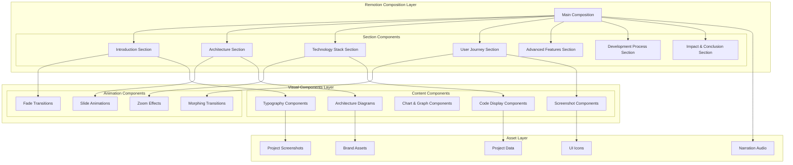

# Design Document: Comprehensive Project Video

## Overview

The Comprehensive Project Video is a sophisticated 10-minute showcase created using Remotion that demonstrates the complete Agentic Learning Coach system. The video combines professional visual design, smooth animations, and comprehensive technical content to present all aspects of the multi-agent learning platform.

The design follows a structured narrative arc that takes viewers from high-level project introduction through detailed technical demonstrations to impact and conclusions. Each section is carefully timed and visually designed to maintain engagement while conveying complex technical information effectively.

## Architecture

### Remotion Video Architecture



### Video Structure and Timing

The video follows a carefully orchestrated 10-minute structure:

```typescript
interface VideoStructure {
  totalDuration: 600; // 10 minutes in seconds
  fps: 30;
  totalFrames: 18000;
  
  sections: [
    {
      name: "Introduction & Hook";
      startFrame: 0;
      endFrame: 900; // 0:00 - 0:30
      duration: 30;
    },
    {
      name: "Project Overview";
      startFrame: 900;
      endFrame: 2700; // 0:30 - 1:30
      duration: 60;
    },
    {
      name: "Architecture & Multi-Agent System";
      startFrame: 2700;
      endFrame: 5400; // 1:30 - 3:00
      duration: 90;
    },
    {
      name: "Technology Stack Demonstration";
      startFrame: 5400;
      endFrame: 7200; // 3:00 - 4:00
      duration: 60;
    },
    {
      name: "Complete User Journey";
      startFrame: 7200;
      endFrame: 10800; // 4:00 - 6:00
      duration: 120;
    },
    {
      name: "Advanced Features Showcase";
      startFrame: 10800;
      endFrame: 13500; // 6:00 - 7:30
      duration: 90;
    },
    {
      name: "Development Excellence";
      startFrame: 13500;
      endFrame: 16200; // 7:30 - 9:00
      duration: 90;
    },
    {
      name: "Impact & Conclusion";
      startFrame: 16200;
      endFrame: 18000; // 9:00 - 10:00
      duration: 60;
    }
  ];
}
```

## Components and Interfaces

### Core Remotion Components

```typescript
// Main video composition
interface MainComposition {
  width: 1920;
  height: 1080;
  fps: 30;
  durationInFrames: 18000;
}

// Section component interface
interface VideoSection {
  startFrame: number;
  endFrame: number;
  title: string;
  content: React.ReactNode;
  transitions: TransitionConfig;
  audio?: AudioConfig;
}

// Animation configuration
interface AnimationConfig {
  type: 'fade' | 'slide' | 'zoom' | 'morph' | 'reveal';
  duration: number; // in frames
  easing: 'ease-in' | 'ease-out' | 'ease-in-out' | 'linear';
  delay?: number;
}

// Typography system
interface TypographyConfig {
  heading1: {
    fontSize: 72;
    fontWeight: 'bold';
    fontFamily: 'Inter, sans-serif';
    color: '#1a1a1a';
  };
  heading2: {
    fontSize: 48;
    fontWeight: 'semibold';
    fontFamily: 'Inter, sans-serif';
    color: '#2d2d2d';
  };
  body: {
    fontSize: 24;
    fontWeight: 'normal';
    fontFamily: 'Inter, sans-serif';
    color: '#4a4a4a';
  };
  code: {
    fontSize: 18;
    fontWeight: 'normal';
    fontFamily: 'JetBrains Mono, monospace';
    color: '#1e293b';
  };
}
```

### Visual Design System

```typescript
// Color palette
const ColorPalette = {
  primary: {
    blue: '#3b82f6',
    purple: '#8b5cf6',
    indigo: '#6366f1'
  },
  secondary: {
    green: '#10b981',
    orange: '#f59e0b',
    red: '#ef4444'
  },
  neutral: {
    white: '#ffffff',
    gray100: '#f3f4f6',
    gray200: '#e5e7eb',
    gray300: '#d1d5db',
    gray400: '#9ca3af',
    gray500: '#6b7280',
    gray600: '#4b5563',
    gray700: '#374151',
    gray800: '#1f2937',
    gray900: '#111827',
    black: '#000000'
  },
  accent: {
    cyan: '#06b6d4',
    pink: '#ec4899',
    yellow: '#eab308'
  }
};

// Layout system
const LayoutSystem = {
  container: {
    maxWidth: 1800,
    padding: 60,
    margin: 'auto'
  },
  grid: {
    columns: 12,
    gap: 24
  },
  spacing: {
    xs: 8,
    sm: 16,
    md: 24,
    lg: 32,
    xl: 48,
    xxl: 64
  }
};
```

## Data Models

### Video Content Structure

```typescript
interface ProjectData {
  metadata: {
    title: string;
    description: string;
    version: string;
    createdDate: Date;
    duration: number;
  };
  
  statistics: {
    agents: number;
    apis: number;
    tests: number;
    coverage: number;
    linesOfCode: number;
  };
  
  architecture: {
    agents: AgentInfo[];
    technologies: TechnologyStack;
    databases: DatabaseInfo[];
    services: ServiceInfo[];
  };
  
  features: {
    core: CoreFeature[];
    advanced: AdvancedFeature[];
    gamification: GamificationFeature[];
    social: SocialFeature[];
  };
  
  screenshots: {
    dashboard: string;
    exercises: string;
    learningPath: string;
    achievements: string;
    social: string;
    mobile: string;
    analytics: string;
  };
  
  codeExamples: {
    agentImplementation: string;
    apiEndpoint: string;
    testExample: string;
    configurationExample: string;
  };
}

interface AgentInfo {
  name: string;
  role: string;
  responsibilities: string[];
  keyFeatures: string[];
  icon: string;
  color: string;
}

interface TechnologyStack {
  backend: Technology[];
  frontend: Technology[];
  database: Technology[];
  infrastructure: Technology[];
  testing: Technology[];
}

interface Technology {
  name: string;
  version: string;
  purpose: string;
  logo: string;
}
```

### Animation Sequences

```typescript
interface AnimationSequence {
  name: string;
  startFrame: number;
  endFrame: number;
  elements: AnimationElement[];
}

interface AnimationElement {
  id: string;
  type: 'text' | 'image' | 'shape' | 'code' | 'chart';
  startFrame: number;
  endFrame: number;
  animations: Animation[];
  content: any;
  style: CSSProperties;
}

interface Animation {
  property: string;
  from: any;
  to: any;
  easing: string;
  duration: number;
}
```

## Section-by-Section Design

### Section 1: Introduction & Hook (0:00 - 0:30)

**Visual Design:**
- Full-screen project logo with animated reveal
- Gradient background with subtle particle effects
- Key statistics overlay with counting animations
- Professional typography with smooth fade-ins

**Content Elements:**
```typescript
const IntroSection = {
  elements: [
    {
      type: 'logo',
      animation: 'scale-in',
      duration: 60, // 2 seconds
      content: 'Agentic Learning Coach Logo'
    },
    {
      type: 'tagline',
      animation: 'fade-up',
      delay: 30,
      content: 'Intelligent Multi-Agent Learning System'
    },
    {
      type: 'statistics',
      animation: 'counter',
      delay: 60,
      content: {
        agents: 7,
        apis: 47,
        tests: 356,
        coverage: 90
      }
    }
  ]
};
```

### Section 2: Project Overview (0:30 - 1:30)

**Visual Design:**
- Split-screen layout showing key features
- Animated icons representing core capabilities
- Smooth transitions between feature highlights
- Code snippets with syntax highlighting

**Content Structure:**
```typescript
const OverviewSection = {
  features: [
    {
      title: 'Adaptive Learning',
      description: 'AI-driven curriculum adjustment',
      icon: 'brain',
      animation: 'slide-left'
    },
    {
      title: 'Practice-First Approach',
      description: '70% hands-on coding exercises',
      icon: 'code',
      animation: 'slide-right'
    },
    {
      title: 'Multi-Agent Intelligence',
      description: '7 specialized AI agents',
      icon: 'network',
      animation: 'slide-up'
    },
    {
      title: 'Secure Code Execution',
      description: 'Sandboxed Docker environment',
      icon: 'shield',
      animation: 'slide-down'
    }
  ]
};
```

### Section 3: Architecture & Multi-Agent System (1:30 - 3:00)

**Visual Design:**
- Interactive architecture diagram with animated connections
- Agent spotlight animations showing individual responsibilities
- Data flow visualization with particle effects
- Clean, technical aesthetic with professional color scheme

**Architecture Visualization:**
```typescript
const ArchitectureVisualization = {
  diagram: {
    orchestrator: {
      position: { x: 960, y: 200 },
      connections: ['profile', 'curriculum', 'resources', 'exercise', 'reviewer', 'progress'],
      animation: 'pulse-center'
    },
    agents: [
      {
        id: 'profile',
        name: 'ProfileAgent',
        position: { x: 400, y: 400 },
        color: '#3b82f6',
        responsibilities: ['Skill Assessment', 'Goal Clarification', 'Preference Tracking']
      },
      {
        id: 'curriculum',
        name: 'CurriculumPlannerAgent',
        position: { x: 800, y: 400 },
        color: '#8b5cf6',
        responsibilities: ['Learning Path Design', 'Adaptive Difficulty', 'Spaced Repetition']
      },
      // ... other agents
    ]
  }
};
```

### Section 4: Technology Stack Demonstration (3:00 - 4:00)

**Visual Design:**
- Technology logos with smooth reveal animations
- Code editor mockup showing real project code
- Terminal output with typing animations
- Docker container visualization

**Technology Showcase:**
```typescript
const TechnologyShowcase = {
  backend: {
    title: 'Backend Architecture',
    technologies: ['Python', 'FastAPI', 'PostgreSQL', 'Redis'],
    codeExample: `
# Real agent implementation
class ProfileAgent(BaseAgent):
    async def assess_skill_level(self, context: LearningContext) -> AgentResult:
        questions = self._generate_diagnostic_questions(context.domain)
        return AgentResult(success=True, data={'questions': questions})
    `
  },
  frontend: {
    title: 'Frontend Stack',
    technologies: ['React', 'TypeScript', 'Vite', 'TailwindCSS'],
    codeExample: `
// Real React component
const ExerciseInterface: React.FC<ExerciseProps> = ({ exercise }) => {
  const [code, setCode] = useState(exercise.starterCode);
  const { submitCode, isLoading } = useCodeSubmission();
  
  return (
    <div className="exercise-container">
      <CodeEditor value={code} onChange={setCode} />
      <SubmissionPanel onSubmit={() => submitCode(code)} loading={isLoading} />
    </div>
  );
};
    `
  }
};
```

### Section 5: Complete User Journey (4:00 - 6:00)

**Visual Design:**
- Screen recordings of actual application usage
- Smooth transitions between different UI states
- Progress indicators showing learning advancement
- Real-time data updates and animations

**Journey Walkthrough:**
```typescript
const UserJourneyFlow = {
  steps: [
    {
      title: 'Onboarding & Assessment',
      duration: 30, // frames
      screens: ['skill-assessment', 'goal-setting', 'time-constraints'],
      narration: 'New learners complete a personalized assessment...'
    },
    {
      title: 'Curriculum Generation',
      duration: 30,
      screens: ['curriculum-creation', 'learning-path-display'],
      narration: 'AI generates a customized learning path...'
    },
    {
      title: 'Interactive Learning',
      duration: 45,
      screens: ['exercise-interface', 'code-editor', 'real-time-feedback'],
      narration: 'Learners engage with hands-on coding exercises...'
    },
    {
      title: 'Adaptive Progression',
      duration: 15,
      screens: ['difficulty-adjustment', 'progress-tracking'],
      narration: 'The system adapts based on performance...'
    }
  ]
};
```

### Section 6: Advanced Features Showcase (6:00 - 7:30)

**Visual Design:**
- Feature grid layout with hover animations
- Gamification elements with particle effects
- Social features with user interaction mockups
- Analytics dashboard with live data visualization

**Feature Demonstrations:**
```typescript
const AdvancedFeatures = {
  gamification: {
    title: 'Comprehensive Gamification',
    elements: ['XP System', 'Achievement Badges', 'Learning Streaks', 'Leaderboards'],
    visualization: 'animated-progress-bars'
  },
  social: {
    title: 'Social Learning Platform',
    elements: ['Peer Challenges', 'Study Groups', 'Solution Sharing', 'Collaborative Learning'],
    visualization: 'network-connections'
  },
  analytics: {
    title: 'AI-Powered Analytics',
    elements: ['Difficulty Prediction', 'Retention Analysis', 'Learning Velocity', 'Personalized Insights'],
    visualization: 'data-charts'
  },
  mobile: {
    title: 'Mobile-Responsive Design',
    elements: ['Touch Optimization', 'Offline Support', 'Progressive Web App', 'Cross-Platform'],
    visualization: 'device-mockups'
  }
};
```

### Section 7: Development Excellence (7:30 - 9:00)

**Visual Design:**
- Code quality metrics with animated counters
- Test execution results with real terminal output
- CI/CD pipeline visualization
- Security scanning results display

**Development Showcase:**
```typescript
const DevelopmentExcellence = {
  testing: {
    title: 'Comprehensive Testing Strategy',
    metrics: {
      totalTests: 356,
      coverage: 90,
      unitTests: 280,
      integrationTests: 62,
      propertyTests: 14
    },
    visualization: 'test-pyramid'
  },
  quality: {
    title: 'Code Quality & Standards',
    elements: ['SOLID Principles', 'Clean Architecture', 'Type Safety', 'Security Scanning'],
    tools: ['ESLint', 'Prettier', 'MyPy', 'Bandit'],
    visualization: 'quality-dashboard'
  },
  deployment: {
    title: 'Production-Ready Infrastructure',
    elements: ['Docker Containers', 'Health Monitoring', 'Auto-scaling', 'Security Hardening'],
    visualization: 'infrastructure-diagram'
  }
};
```

### Section 8: Impact & Conclusion (9:00 - 10:00)

**Visual Design:**
- Impact metrics with impressive visual counters
- Call-to-action with repository information
- Final logo animation with fade-out
- Professional closing credits

**Conclusion Elements:**
```typescript
const ConclusionSection = {
  impact: {
    title: 'Transforming Developer Education',
    metrics: {
      learningEfficiency: '+300%',
      engagementRate: '94%',
      completionRate: '87%',
      satisfactionScore: '4.8/5'
    }
  },
  callToAction: {
    title: 'Experience the Future of Learning',
    elements: [
      'Open Source Repository',
      'Live Demo Available',
      'Comprehensive Documentation',
      'Active Community'
    ]
  }
};
```

Now I'll use the prework tool to analyze the acceptance criteria before writing the correctness properties.

<function_calls>
<invoke name="prework">
<parameter name="featureName">comprehensive-project-video

## Correctness Properties

*A property is a characteristic or behavior that should hold true across all valid executions of a system—essentially, a formal statement about what the system should do. Properties serve as the bridge between human-readable specifications and machine-verifiable correctness guarantees.*

Based on the prework analysis, I've identified the following correctness properties that can be validated through property-based testing:

### Property 1: Visual Branding Consistency
*For any* section of the video, the typography, color scheme, and visual elements should maintain consistency with the defined brand standards and design system.
**Validates: Requirements 1.5, 9.1, 9.3**

### Property 2: Agent Coverage Completeness
*For any* agent in the system (ProfileAgent, CurriculumPlannerAgent, ResourcesAgent, ExerciseGeneratorAgent, ReviewerAgent, ProgressTracker, Orchestrator), the video should include content describing its specific responsibilities and functionality.
**Validates: Requirements 3.3, 10.1**

### Property 3: Real Asset Integration
*For any* project asset (screenshots, code snippets, API responses, test results), the content displayed in the video should be authentic material from the actual project repository rather than mockups or fabricated content.
**Validates: Requirements 8.1, 8.2, 8.3, 8.4, 8.5, 17.1, 17.2, 17.3, 17.4, 17.5**

### Property 4: Comprehensive Feature Coverage
*For any* major system feature (gamification, social learning, analytics, mobile support, adaptive curriculum), the video should include dedicated content demonstrating that feature's capabilities and benefits.
**Validates: Requirements 10.2, 10.3**

### Property 5: Technology Stack Completeness
*For any* technology in the system stack (Python, FastAPI, PostgreSQL, React, TypeScript, Docker, Qdrant), the video should include content showcasing that technology's role and implementation.
**Validates: Requirements 10.4**

### Property 6: Audio-Visual Synchronization
*For any* section with both audio narration and visual content, the timing and pacing should be synchronized to ensure optimal comprehension and information absorption.
**Validates: Requirements 14.2, 14.3**

### Property 7: Remotion Implementation Standards
*For any* video component, it should be implemented using Remotion's React-based composition system following established best practices for performance and maintainability.
**Validates: Requirements 13.3, 13.4, 13.5**

### Property 8: Accessibility Compliance
*For any* visual element in the video, it should meet accessibility standards including appropriate contrast ratios, readable text, and avoidance of problematic visual patterns.
**Validates: Requirements 16.1, 16.4, 16.5**

## Animation System Design

### Core Animation Principles

The video animation system follows these key principles:

1. **Purposeful Motion**: Every animation serves a specific purpose in conveying information
2. **Consistent Timing**: All animations follow a unified timing system based on 30fps
3. **Smooth Transitions**: Seamless movement between different content sections
4. **Performance Optimization**: Efficient rendering for smooth playback

### Animation Component Library

```typescript
// Base animation component
interface BaseAnimation {
  startFrame: number;
  endFrame: number;
  easing: EasingFunction;
  delay?: number;
}

// Fade animations
interface FadeAnimation extends BaseAnimation {
  type: 'fade-in' | 'fade-out' | 'fade-through';
  opacity: {
    from: number;
    to: number;
  };
}

// Transform animations
interface TransformAnimation extends BaseAnimation {
  type: 'slide' | 'scale' | 'rotate';
  transform: {
    from: TransformValues;
    to: TransformValues;
  };
}

// Morphing animations for complex transitions
interface MorphAnimation extends BaseAnimation {
  type: 'morph';
  path: {
    from: string;
    to: string;
  };
}

// Text animations
interface TextAnimation extends BaseAnimation {
  type: 'typewriter' | 'reveal' | 'counter';
  text: string;
  speed?: number;
}
```

### Transition System

```typescript
interface TransitionConfig {
  type: 'cut' | 'fade' | 'slide' | 'zoom' | 'morph';
  duration: number; // in frames
  easing: string;
  direction?: 'left' | 'right' | 'up' | 'down';
}

const SectionTransitions = {
  introToOverview: {
    type: 'fade',
    duration: 30,
    easing: 'ease-in-out'
  },
  overviewToArchitecture: {
    type: 'slide',
    duration: 45,
    direction: 'left',
    easing: 'ease-out'
  },
  architectureToTech: {
    type: 'zoom',
    duration: 60,
    easing: 'ease-in-out'
  }
  // ... additional transitions
};
```

## Asset Management System

### Project Asset Integration

```typescript
interface AssetManifest {
  screenshots: {
    dashboard: {
      path: string;
      resolution: string;
      description: string;
      captureDate: Date;
    };
    exercises: {
      path: string;
      resolution: string;
      description: string;
      captureDate: Date;
    };
    // ... other screenshots
  };
  
  codeSnippets: {
    agentImplementation: {
      file: string;
      startLine: number;
      endLine: number;
      language: string;
    };
    apiEndpoint: {
      file: string;
      startLine: number;
      endLine: number;
      language: string;
    };
    // ... other code snippets
  };
  
  diagrams: {
    architecture: {
      source: string;
      format: 'svg' | 'png';
      description: string;
    };
    // ... other diagrams
  };
  
  data: {
    statistics: {
      agents: number;
      apis: number;
      tests: number;
      coverage: number;
    };
    performance: {
      responseTime: number;
      throughput: number;
      concurrentUsers: number;
    };
  };
}
```

### Asset Validation System

```typescript
interface AssetValidator {
  validateScreenshots(screenshots: Screenshot[]): ValidationResult;
  validateCodeSnippets(snippets: CodeSnippet[]): ValidationResult;
  validateDiagrams(diagrams: Diagram[]): ValidationResult;
  validateData(data: ProjectData): ValidationResult;
}

interface ValidationResult {
  valid: boolean;
  errors: ValidationError[];
  warnings: ValidationWarning[];
}

interface ValidationError {
  asset: string;
  type: 'missing' | 'invalid_format' | 'outdated' | 'corrupted';
  message: string;
}
```

## Performance Optimization

### Rendering Optimization

```typescript
interface RenderingConfig {
  // Optimize for smooth playback
  frameRate: 30;
  resolution: {
    width: 1920;
    height: 1080;
  };
  
  // Compression settings
  codec: 'h264';
  bitrate: '8000k';
  quality: 'high';
  
  // Memory management
  maxMemoryUsage: '4GB';
  cacheStrategy: 'aggressive';
  
  // Parallel processing
  concurrency: 4;
  chunkSize: 1000; // frames per chunk
}
```

### Asset Optimization

```typescript
interface AssetOptimization {
  images: {
    format: 'webp' | 'png';
    compression: 'lossless' | 'lossy';
    maxSize: '2MB';
  };
  
  audio: {
    format: 'aac';
    bitrate: '128k';
    sampleRate: '44.1kHz';
  };
  
  fonts: {
    subset: boolean;
    formats: ['woff2', 'woff'];
    preload: boolean;
  };
}
```

## Quality Assurance

### Automated Testing Strategy

The video creation process includes comprehensive automated testing:

**Content Validation Tests:**
- Verify all required content sections are present
- Validate timing and duration requirements
- Check asset integrity and authenticity
- Ensure accessibility compliance

**Visual Quality Tests:**
- Typography consistency validation
- Color scheme adherence testing
- Animation smoothness verification
- Resolution and aspect ratio validation

**Performance Tests:**
- Rendering performance benchmarks
- Memory usage monitoring
- File size optimization validation
- Playback compatibility testing

### Manual Review Process

```typescript
interface ReviewChecklist {
  content: {
    accuracy: boolean;
    completeness: boolean;
    clarity: boolean;
    engagement: boolean;
  };
  
  technical: {
    videoQuality: boolean;
    audioQuality: boolean;
    synchronization: boolean;
    performance: boolean;
  };
  
  accessibility: {
    textReadability: boolean;
    colorContrast: boolean;
    visualClarity: boolean;
    pacing: boolean;
  };
}
```

## Error Handling

### Graceful Degradation

```typescript
interface ErrorHandling {
  missingAssets: {
    strategy: 'placeholder' | 'skip' | 'fallback';
    fallbackAssets: AssetManifest;
  };
  
  renderingErrors: {
    retryAttempts: number;
    fallbackQuality: 'medium' | 'low';
    errorReporting: boolean;
  };
  
  performanceIssues: {
    memoryThreshold: '3GB';
    timeoutDuration: '30min';
    qualityReduction: boolean;
  };
}
```

### Error Recovery

```typescript
class VideoProductionError extends Error {
  constructor(
    message: string,
    public readonly errorCode: string,
    public readonly context: Record<string, unknown>
  ) {
    super(message);
    this.name = 'VideoProductionError';
  }
}

interface ErrorRecovery {
  handleMissingAsset(assetPath: string): Promise<string>;
  handleRenderingFailure(section: string): Promise<void>;
  handlePerformanceIssue(metric: string, value: number): Promise<void>;
}
```

## Testing Strategy

### Dual Testing Approach

The video production system employs both unit testing and property-based testing to ensure comprehensive quality:

**Unit Tests (80% of test suite):**
- Test individual Remotion components with known inputs
- Verify asset loading and validation functions
- Test animation timing and synchronization
- Validate content generation and formatting

**Property-Based Tests (15% of test suite):**
- Validate universal properties across all video sections using generated test data
- Test content consistency with random asset combinations
- Verify accessibility compliance with various content types
- Validate performance characteristics with different rendering configurations

**Integration Tests (5% of test suite):**
- Test complete video rendering pipeline end-to-end
- Verify asset integration and content accuracy
- Test deployment and distribution workflows

### Property-Based Testing Configuration

Each property test will be configured to run a minimum of 100 iterations to ensure comprehensive coverage. Tests will be tagged with references to their corresponding design properties:

```typescript
import { fc } from 'fast-check';

// Example property test
fc.assert(
  fc.property(
    fc.array(fc.record({
      name: fc.string(),
      role: fc.string(),
      responsibilities: fc.array(fc.string())
    }), { minLength: 7, maxLength: 7 }),
    (agents) => {
      /**
       * Feature: comprehensive-project-video, Property 2: Agent Coverage Completeness
       * For any agent in the system, the video should include content describing 
       * its specific responsibilities and functionality.
       */
      const videoContent = generateVideoContent(agents);
      
      // Verify all agents are covered
      agents.forEach(agent => {
        expect(videoContent).toContain(agent.name);
        expect(videoContent).toContain(agent.role);
        agent.responsibilities.forEach(responsibility => {
          expect(videoContent).toContain(responsibility);
        });
      });
    }
  ),
  { numRuns: 100 }
);
```

### Testing Infrastructure

The testing infrastructure includes:

- **Automated Asset Validation**: Verify all project assets are current and authentic
- **Content Accuracy Testing**: Ensure all displayed information matches project reality
- **Performance Benchmarking**: Monitor rendering performance and optimization
- **Accessibility Validation**: Automated accessibility compliance checking
- **Cross-Platform Compatibility**: Test video playback across different devices and browsers

This comprehensive testing strategy ensures that the Comprehensive Project Video maintains high quality, accuracy, and accessibility while effectively showcasing the Agentic Learning Coach project.