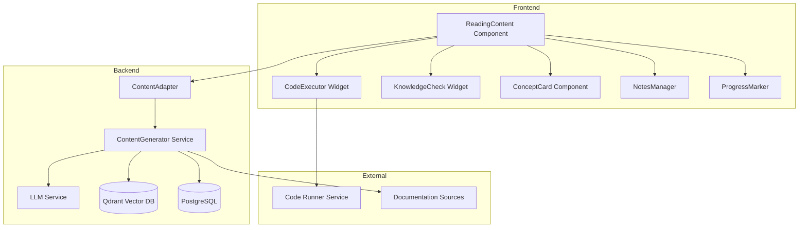
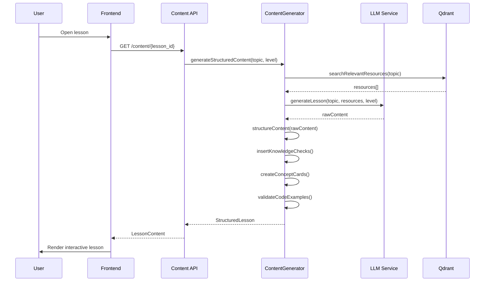

# Design Document: Enriched Learning Content

## Overview

This design transforms the current placeholder-based reading materials into a rich, interactive learning experience. The system will generate structured educational content with multiple explanation styles, executable code examples, inline knowledge checks, and adaptive depth based on learner skill level.

The core philosophy is "learn by doing" - every concept should be immediately practicable, and content should adapt to how well the learner is understanding the material.

## Architecture

### High-Level Component Diagram



### Content Generation Pipeline



## Components and Interfaces

### 1. Content Data Models

```typescript
// Core lesson structure
interface StructuredLesson {
  id: string;
  title: string;
  topic: string;
  metadata: LessonMetadata;
  objectives: string[];
  sections: ContentSection[];
  keyTakeaways: string[];
  relatedResources: Resource[];
  version: string;
}

interface LessonMetadata {
  estimatedMinutes: number;
  difficulty: 'beginner' | 'intermediate' | 'advanced';
  prerequisites: string[];
  technology: string;
  lastUpdated: string;
}

interface ContentSection {
  id: string;
  type: 'text' | 'concept-card' | 'code-example' | 'knowledge-check' | 'diagram';
  order: number;
  content: TextBlock | ConceptCard | CodeExample | KnowledgeCheck | Diagram;
  completionRequired: boolean;
}

// Concept Card - multiple explanation styles
interface ConceptCard {
  id: string;
  conceptName: string;
  primaryExplanation: string;
  analogy: {
    title: string;
    description: string;
    mapping: Record<string, string>; // concept term -> analogy term
  };
  diagram?: MermaidDiagram;
  alternativeExplanations: string[];
  commonMistakes: Mistake[];
  whenToUse: UseCase[];
  codeSnippet?: CodeSnippet;
}

interface Mistake {
  description: string;
  example: string;
  correction: string;
}

interface UseCase {
  scenario: string;
  example: string;
  benefit: string;
}

// Interactive Code Example
interface CodeExample {
  id: string;
  title: string;
  description: string;
  language: 'javascript' | 'typescript' | 'python' | 'java';
  starterCode: string;
  solutionCode: string;
  testCases: TestCase[];
  hints: string[];
  isEditable: boolean;
  expectedOutput?: string;
}

interface TestCase {
  input: string;
  expectedOutput: string;
  description: string;
}

// Knowledge Check
interface KnowledgeCheck {
  id: string;
  question: string;
  type: 'multiple-choice' | 'fill-blank' | 'code-completion' | 'true-false';
  options?: Option[];
  correctAnswer: string | string[];
  explanation: string;
  hint: string;
  relatedConceptId?: string;
  difficulty: number; // 1-5
}

interface Option {
  id: string;
  text: string;
  isCorrect: boolean;
  feedback: string;
}

// Diagram support
interface MermaidDiagram {
  type: 'flowchart' | 'sequence' | 'class' | 'state' | 'er';
  code: string;
  caption: string;
  altText: string; // Accessibility
}

// Resource linking
interface Resource {
  id: string;
  title: string;
  url: string;
  type: 'documentation' | 'tutorial' | 'video' | 'article' | 'reference';
  category: 'essential' | 'recommended' | 'deep-dive';
  estimatedMinutes: number;
  verified: boolean;
  lastVerified: string;
}
```

### 2. Backend Services

```python
# Content Generator Service Interface
class ContentGeneratorService:
    """Generates structured educational content using LLM and resources."""
    
    async def generate_lesson(
        self,
        topic: str,
        skill_level: SkillLevel,
        technology: str,
        requirements: list[str]
    ) -> StructuredLesson:
        """Generate a complete structured lesson."""
        pass
    
    async def generate_concept_card(
        self,
        concept: str,
        skill_level: SkillLevel,
        context: str
    ) -> ConceptCard:
        """Generate a concept card with multiple explanation styles."""
        pass
    
    async def generate_knowledge_check(
        self,
        concept: str,
        difficulty: int,
        check_type: KnowledgeCheckType
    ) -> KnowledgeCheck:
        """Generate a knowledge check question."""
        pass
    
    async def validate_code_example(
        self,
        code: str,
        language: str,
        test_cases: list[TestCase]
    ) -> ValidationResult:
        """Validate that code example works correctly."""
        pass
    
    async def get_alternative_explanation(
        self,
        concept_id: str,
        previous_explanations: list[str]
    ) -> str:
        """Generate an alternative explanation for a concept."""
        pass


# Content Adapter - handles caching and retrieval
class ContentAdapter:
    """Adapts content based on user preferences and progress."""
    
    async def get_lesson_for_user(
        self,
        lesson_id: str,
        user_id: str
    ) -> AdaptedLesson:
        """Get lesson adapted to user's skill level and progress."""
        pass
    
    async def adjust_content_depth(
        self,
        lesson_id: str,
        user_id: str,
        performance_data: PerformanceData
    ) -> ContentAdjustment:
        """Adjust content depth based on knowledge check performance."""
        pass
    
    async def save_user_progress(
        self,
        user_id: str,
        lesson_id: str,
        progress: LessonProgress
    ) -> None:
        """Save user's reading progress and completions."""
        pass
```

### 3. Frontend Components

```typescript
// Main Reading Content Component
interface ReadingContentProps {
  lessonId: string;
  onComplete: () => void;
  onProgressUpdate: (progress: number) => void;
}

// Concept Card Component
interface ConceptCardProps {
  card: ConceptCard;
  skillLevel: SkillLevel;
  onRequestAlternative: () => void;
  isExpanded: boolean;
}

// Interactive Code Example Component
interface CodeExampleProps {
  example: CodeExample;
  onRun: (code: string) => Promise<ExecutionResult>;
  onReset: () => void;
  showHints: boolean;
}

// Knowledge Check Component
interface KnowledgeCheckProps {
  check: KnowledgeCheck;
  onAnswer: (answer: string) => void;
  onRequestHint: () => void;
  attempts: number;
  maxAttempts: number;
}

// Progress Marker Component
interface ProgressMarkerProps {
  sections: ContentSection[];
  completedSections: string[];
  currentSection: string;
  onNavigate: (sectionId: string) => void;
}

// Notes Manager Component
interface NotesManagerProps {
  lessonId: string;
  highlights: Highlight[];
  notes: Note[];
  onAddHighlight: (selection: TextSelection) => void;
  onAddNote: (sectionId: string, content: string) => void;
  onExport: () => void;
}
```

## Data Models

### Database Schema Extensions

```sql
-- Lesson content storage
CREATE TABLE lesson_content (
    id UUID PRIMARY KEY DEFAULT gen_random_uuid(),
    topic_id UUID NOT NULL REFERENCES learning_topics(id) ON DELETE CASCADE,
    title VARCHAR(255) NOT NULL,
    content_json JSONB NOT NULL, -- Stores StructuredLesson
    version VARCHAR(20) NOT NULL,
    skill_level skill_level_enum NOT NULL,
    estimated_minutes INTEGER NOT NULL,
    created_at TIMESTAMPTZ DEFAULT NOW(),
    updated_at TIMESTAMPTZ DEFAULT NOW()
);

-- User reading progress
CREATE TABLE reading_progress (
    id UUID PRIMARY KEY DEFAULT gen_random_uuid(),
    user_id UUID NOT NULL REFERENCES users(id) ON DELETE CASCADE,
    lesson_id UUID NOT NULL REFERENCES lesson_content(id) ON DELETE CASCADE,
    current_section_id VARCHAR(100),
    completed_sections JSONB DEFAULT '[]',
    knowledge_check_results JSONB DEFAULT '{}',
    scroll_position INTEGER DEFAULT 0,
    time_spent_seconds INTEGER DEFAULT 0,
    completed BOOLEAN DEFAULT FALSE,
    completed_at TIMESTAMPTZ,
    last_accessed_at TIMESTAMPTZ DEFAULT NOW(),
    created_at TIMESTAMPTZ DEFAULT NOW(),
    UNIQUE(user_id, lesson_id)
);

-- User notes and highlights
CREATE TABLE user_content_notes (
    id UUID PRIMARY KEY DEFAULT gen_random_uuid(),
    user_id UUID NOT NULL REFERENCES users(id) ON DELETE CASCADE,
    lesson_id UUID NOT NULL REFERENCES lesson_content(id) ON DELETE CASCADE,
    section_id VARCHAR(100),
    note_type VARCHAR(20) NOT NULL CHECK (note_type IN ('highlight', 'note')),
    content TEXT NOT NULL,
    selection_start INTEGER, -- For highlights
    selection_end INTEGER,
    color VARCHAR(20), -- Highlight color
    created_at TIMESTAMPTZ DEFAULT NOW(),
    updated_at TIMESTAMPTZ DEFAULT NOW()
);

-- Knowledge check attempts
CREATE TABLE knowledge_check_attempts (
    id UUID PRIMARY KEY DEFAULT gen_random_uuid(),
    user_id UUID NOT NULL REFERENCES users(id) ON DELETE CASCADE,
    lesson_id UUID NOT NULL REFERENCES lesson_content(id) ON DELETE CASCADE,
    check_id VARCHAR(100) NOT NULL,
    answer TEXT NOT NULL,
    is_correct BOOLEAN NOT NULL,
    attempt_number INTEGER NOT NULL,
    time_taken_seconds INTEGER,
    created_at TIMESTAMPTZ DEFAULT NOW()
);

-- Indexes for performance
CREATE INDEX idx_reading_progress_user ON reading_progress(user_id);
CREATE INDEX idx_reading_progress_lesson ON reading_progress(lesson_id);
CREATE INDEX idx_user_notes_user_lesson ON user_content_notes(user_id, lesson_id);
CREATE INDEX idx_kc_attempts_user_lesson ON knowledge_check_attempts(user_id, lesson_id);
```

## Correctness Properties

*A property is a characteristic or behavior that should hold true across all valid executions of a system-essentially, a formal statement about what the system should do. Properties serve as the bridge between human-readable specifications and machine-verifiable correctness guarantees.*

### Property 1: Lesson Structure Completeness
*For any* generated lesson content, the lesson SHALL contain a "What You'll Learn" objectives list at the beginning, structured sections with clear headings, and a "Key Takeaways" summary at the end.
**Validates: Requirements 1.1, 1.4, 1.5**

### Property 2: Section Length Constraint
*For any* content section in a generated lesson, if the section exceeds 500 words, it SHALL be broken into subsections with transition text.
**Validates: Requirements 1.3**

### Property 3: Code Example Validity
*For any* code example in generated content, executing the starter code SHALL either pass all provided test cases or produce a clear, expected error state with helpful suggestions.
**Validates: Requirements 2.1, 2.5, 9.1**

### Property 4: Code Example Coverage
*For any* concept introduced in lesson content, there SHALL be at least one interactive code example demonstrating that concept.
**Validates: Requirements 2.3**

### Property 5: Knowledge Check Density
*For any* generated lesson content, there SHALL be at least one knowledge check for every 300-500 words of explanatory text.
**Validates: Requirements 4.1**

### Property 6: Knowledge Check Feedback Completeness
*For any* knowledge check answer (correct or incorrect), the system SHALL provide specific feedback explaining why the answer is right or wrong, with positive reinforcement for correct answers and explanatory guidance for incorrect ones.
**Validates: Requirements 4.2, 4.3**

### Property 7: Concept Card Completeness
*For any* concept card generated by the Content_Engine, it SHALL contain: a primary text explanation, at least one real-world analogy, a "Common Mistakes" section, and a "When to Use" section.
**Validates: Requirements 3.1, 3.2, 3.5, 3.6**

### Property 8: Alternative Explanation Uniqueness
*For any* "Explain Differently" request on a concept, the returned explanation SHALL be semantically different from all previously provided explanations for that concept.
**Validates: Requirements 3.4**

### Property 9: Adaptive Content Consistency
*For any* beginner-level content, it SHALL contain more foundational explanations and analogies than advanced-level content for the same topic. *For any* advanced-level content, it SHALL focus on nuances, edge cases, and best practices.
**Validates: Requirements 5.1, 5.2**

### Property 10: Adaptive Difficulty Adjustment
*For any* learner whose knowledge check performance indicates struggle (≥2 consecutive failures), the system SHALL increase explanation depth. *For any* learner whose performance indicates mastery (≥3 consecutive successes), the system SHALL reduce redundant explanations.
**Validates: Requirements 5.5, 5.6**

### Property 11: Diagram Accessibility
*For any* visual content (diagram, flowchart, illustration) in generated content, it SHALL have a text alternative (alt text) for accessibility.
**Validates: Requirements 6.6**

### Property 12: Resource Metadata Completeness
*For any* external resource linked in content, it SHALL have: a category (Essential/Recommended/Deep Dive), type, estimated time, and difficulty level.
**Validates: Requirements 7.2, 7.4**

### Property 13: Resource Verification
*For any* external resource linked in content, the resource URL SHALL be accessible and return a valid HTTP response.
**Validates: Requirements 7.3**

### Property 14: Progress Persistence Round-Trip
*For any* user reading progress saved to the database (position, completed sections, knowledge check results), retrieving that progress SHALL return the exact same data.
**Validates: Requirements 8.1, 8.2, 8.3, 8.6**

### Property 15: Completion Percentage Accuracy
*For any* lesson with N total sections, if M sections are completed, the displayed completion percentage SHALL equal (M/N) × 100, rounded to the nearest integer.
**Validates: Requirements 8.4**

### Property 16: Notes and Highlights Persistence
*For any* highlight or note created by a user, it SHALL persist across sessions and be displayed when the user returns to that content section.
**Validates: Requirements 10.3, 10.6**

### Property 17: Notes Export Completeness
*For any* set of user notes and highlights, exporting to markdown SHALL include all notes and highlights with their associated section context, and the export SHALL be valid markdown.
**Validates: Requirements 10.4, 10.5**

### Property 18: Mermaid Diagram Validity
*For any* diagram in generated content, the Mermaid syntax SHALL be valid and renderable without errors.
**Validates: Requirements 6.4**

## Error Handling

### Content Generation Failures

```typescript
// Graceful degradation strategy
interface ContentFallbackStrategy {
  // Level 1: Use cached content if available
  useCachedContent(lessonId: string): Promise<StructuredLesson | null>;
  
  // Level 2: Generate simplified content without LLM
  generateSimplifiedContent(topic: string, requirements: string[]): StructuredLesson;
  
  // Level 3: Show curated external resources
  showExternalResources(topic: string): Resource[];
}

// Error types
enum ContentError {
  LLM_UNAVAILABLE = 'llm_unavailable',
  INVALID_TOPIC = 'invalid_topic',
  CODE_VALIDATION_FAILED = 'code_validation_failed',
  RESOURCE_NOT_FOUND = 'resource_not_found',
  PROGRESS_SAVE_FAILED = 'progress_save_failed'
}

// User-friendly error messages
const ERROR_MESSAGES: Record<ContentError, string> = {
  [ContentError.LLM_UNAVAILABLE]: 
    'We\'re having trouble generating fresh content. Here\'s some curated material instead.',
  [ContentError.CODE_VALIDATION_FAILED]: 
    'This code example couldn\'t be verified. Please report this issue.',
  [ContentError.PROGRESS_SAVE_FAILED]: 
    'Your progress couldn\'t be saved. Don\'t worry, we\'ll try again automatically.'
};
```

### Code Execution Errors

```typescript
interface CodeExecutionError {
  type: 'syntax' | 'runtime' | 'timeout' | 'security';
  message: string;
  line?: number;
  suggestion: string;
}

// Helpful error suggestions
function getErrorSuggestion(error: CodeExecutionError): string {
  switch (error.type) {
    case 'syntax':
      return `Check line ${error.line} for syntax issues. Common causes: missing brackets, semicolons, or typos.`;
    case 'runtime':
      return `Your code ran but encountered an error. Check for undefined variables or incorrect function calls.`;
    case 'timeout':
      return `Your code took too long to run. Check for infinite loops or very large operations.`;
    case 'security':
      return `This code uses restricted operations. Try a different approach.`;
  }
}
```

## Testing Strategy

### Unit Tests
- Content structure validation
- Knowledge check answer evaluation
- Progress calculation logic
- Markdown rendering
- Code syntax highlighting

### Property-Based Tests
- Code example validity (Property 1)
- Knowledge check placement (Property 2)
- Concept card completeness (Property 3)
- Progress round-trip (Property 4)
- Adaptive content consistency (Property 5)

### Integration Tests
- Full lesson generation pipeline
- User progress persistence
- Code execution integration
- LLM service integration

### E2E Tests
- Complete reading flow
- Knowledge check interaction
- Code example editing and execution
- Notes and highlights
- Progress resumption

### Testing Libraries
- Backend: pytest with hypothesis for property-based testing
- Frontend: Jest + React Testing Library
- E2E: Cypress
- Property-based: fast-check (TypeScript), hypothesis (Python)
