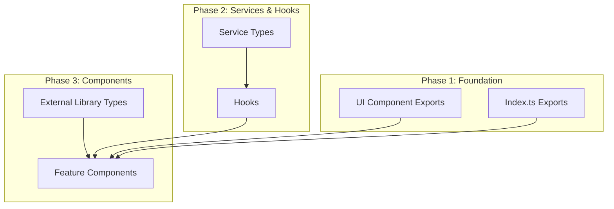

# Design Document

## Overview

This design document outlines the systematic approach to fixing ~235 TypeScript compilation errors across ~66 files in the frontend codebase. The errors fall into distinct categories that can be addressed in a specific order to maximize efficiency - fixing foundational issues first (UI components, exports) will automatically resolve many downstream errors.

## Architecture

The frontend follows a standard React architecture with:
- **UI Components** (`src/components/ui/`): Reusable base components
- **Feature Components** (`src/components/*/`): Domain-specific components
- **Services** (`src/services/`): API communication layer
- **Hooks** (`src/hooks/`): Reusable stateful logic
- **Types** (`src/types/`): TypeScript type definitions
- **Pages** (`src/pages/`): Route-level components

### Error Flow Diagram



## Components and Interfaces

### UI Component Exports (src/components/ui/index.ts)

Current exports need to be extended:

```typescript
// Required exports
export { Button } from './Button';
export type { ButtonProps } from './Button';
export { Card } from './Card';
export type { CardProps } from './Card';
export { Input } from './Input';
export type { InputProps } from './Input';
export { Modal } from './Modal';
export { Select } from './Select';
export { Textarea } from './Textarea';
export { Toast } from './Toast';
export { ToastContainer } from './ToastContainer';
export { Progress } from './Progress'; // NEW - needs to be created
```

### Progress Component Interface

```typescript
interface ProgressProps {
  value: number;
  max?: number;
  className?: string;
  showLabel?: boolean;
  size?: 'sm' | 'md' | 'lg';
  variant?: 'default' | 'success' | 'warning' | 'error';
}
```

### Extended Button Variants

```typescript
type ButtonVariant = 
  | 'primary' 
  | 'secondary' 
  | 'outline' 
  | 'ghost' 
  | 'success' 
  | 'error' 
  | 'warning'
  | 'default'      // NEW - alias for primary
  | 'destructive'; // NEW - alias for error
```

### Extended Card Props

```typescript
interface CardProps extends React.HTMLAttributes<HTMLDivElement> {
  children: React.ReactNode;
  className?: string;
  variant?: 'default' | 'outlined' | 'elevated';
  // Event handlers inherited from HTMLAttributes
}
```

### Extended Input Props

```typescript
interface InputProps extends React.InputHTMLAttributes<HTMLInputElement> {
  label?: string;
  error?: string;
  icon?: React.ReactNode; // NEW
}
```

## Data Models

### Service Return Type Alignment

#### Dashboard Service

```typescript
interface DashboardAnalytics {
  learningPatterns: {
    mostActiveDay: string;
    mostActiveDayCount: number;
    averageDaily: number;
    consistencyScore: number; // Ensure this is included
    patterns: string[];
  } | null;
  optimalStudyTimes: string[];
  mostActiveDay: string | undefined;
  averageDaily: number;
  consistencyScore: number; // Add at top level too
}
```

#### Collaboration Service Interface

```typescript
interface CollaborationService {
  // Public methods
  connect(): Promise<void>;
  disconnect(): void;
  createStudyGroup(data: Partial<StudyGroup>): Promise<StudyGroup>;
  joinStudyGroup(groupId: string): Promise<StudyGroup>;
  // ... existing methods
  
  // NEW: Add missing methods
  inviteToSession(userId: string, sessionId: string): Promise<void>;
  on(event: string, callback: Function): void;
  
  // Expose WebSocket state
  isConnected: boolean;
  error: string | null;
}
```

### Hook Return Type Fixes

#### useWebSocket Return Type

```typescript
interface UseWebSocketReturn {
  // Existing
  connect: () => Promise<void>;
  disconnect: () => void;
  send: (message: unknown) => void;
  
  // Add missing properties
  isConnected: boolean;
  lastMessage: string | null;
  error: string | null;
}
```

## Correctness Properties

*A property is a characteristic or behavior that should hold true across all valid executions of a system-essentially, a formal statement about what the system should do. Properties serve as the bridge between human-readable specifications and machine-verifiable correctness guarantees.*

### Property 1: TypeScript Compilation Success
*For any* valid TypeScript file in the frontend/src directory, running `tsc --noEmit` SHALL produce zero errors for that file.
**Validates: Requirements 1.1, 2.1, 3.1, 4.1, 5.1, 6.1, 7.1, 8.1, 9.1, 10.1, 11.1, 12.1, 13.1, 14.1, 15.1**

### Property 2: Export Completeness
*For any* component that is imported from a module's index.ts, that component SHALL be exported from the index.ts file.
**Validates: Requirements 1.1, 1.2, 1.3, 2.1, 3.1**

### Property 3: Type Consistency
*For any* service function return value, the type SHALL match the type expected by all consuming hooks and components.
**Validates: Requirements 4.1, 4.2, 4.3, 12.1, 12.2, 12.3**

### Property 4: Import Validity
*For any* import statement referencing an external library, the imported member SHALL exist in that library's type definitions.
**Validates: Requirements 6.1, 6.2, 7.1, 7.2, 7.3, 7.4**

## Error Handling

### Missing Component Strategy
When a component is imported but doesn't exist:
1. Check if it's a typo - fix the import
2. Check if it exists elsewhere - update the import path
3. Create a minimal implementation if truly missing

### Type Mismatch Strategy
When types don't align:
1. Identify the "source of truth" (usually the service/API)
2. Update consuming code to match the source
3. Add type assertions only as last resort with TODO comments

### External Library Strategy
When external library types are wrong:
1. Check for library updates
2. Use correct import paths
3. Create local type augmentations if needed

## Testing Strategy

### Validation Approach
The primary validation is TypeScript compilation:

```bash
# Run from frontend directory
npx tsc --noEmit
```

Success criteria: Zero errors output.

### Incremental Validation
After each module fix:
1. Run `tsc --noEmit` to check error count
2. Verify error count decreased
3. Ensure no new errors introduced

### Module-by-Module Checklist
- [ ] UI Components (src/components/ui/)
- [ ] Index files (*/index.ts)
- [ ] Services (src/services/)
- [ ] Hooks (src/hooks/)
- [ ] Analytics components
- [ ] Collaboration components
- [ ] Settings components
- [ ] Leaderboard components
- [ ] Notifications components
- [ ] Social components
- [ ] Gamification components
- [ ] Exercises components
- [ ] Dashboard components
- [ ] Learning path components
- [ ] Tasks components
- [ ] Pages
- [ ] Test files
