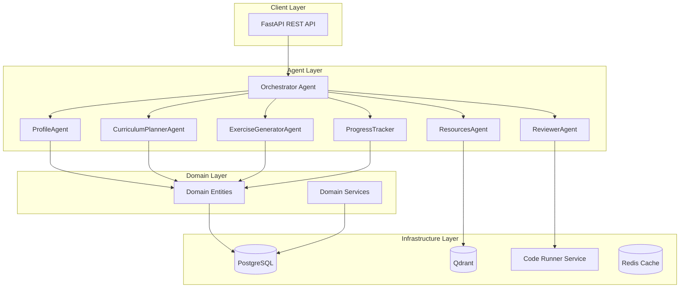

# 🎓 Agentic Learning Coach for Developers

> An intelligent multi-agent system that provides personalized coding education and mentorship for developers.

[]()
[]()
[]()
[]()

Built with [Kiro CLI](https://kiro.dev) using spec-driven development.

## ✨ Features

| Feature | Description |
|---------|-------------|
| 🧠 **Adaptive Learning** | AI-driven curriculum that adjusts to learner pace and skill level |
| 💻 **Practice-First** | 70% hands-on coding exercises with immediate feedback |
| 🤖 **Multi-Agent Intelligence** | 7 specialized agents for different aspects of learning |
| 🔒 **Secure Code Execution** | Sandboxed Docker environment for running untrusted code |
| 📊 **Progress Tracking** | Detailed analytics with adaptive difficulty adjustment |
| 📚 **Resource Discovery** | Semantic search for relevant learning materials |

## 🏗️ Architecture

The system follows **clean architecture** principles with a multi-agent design pattern:



### Agent Responsibilities

| Agent | Role | Key Features |
|-------|------|--------------|
| **Orchestrator** | Routes intents, coordinates workflows | Intent classification, error recovery |
| **ProfileAgent** | Manages learner profiles | Skill assessment, goal parsing |
| **CurriculumPlannerAgent** | Designs learning paths | Adaptive difficulty, spaced repetition |
| **ExerciseGeneratorAgent** | Creates practice exercises | Difficulty scaling, hint generation |
| **ReviewerAgent** | Evaluates code submissions | Test execution, feedback generation |
| **ResourcesAgent** | Curates learning materials | Semantic search, quality filtering |
| **ProgressTracker** | Monitors learning progress | Adaptation triggers, analytics |

### Project Structure

```
├── src/
│   ├── domain/           # Core business entities and rules
│   │   ├── entities/     # UserProfile, LearningPlan, Task, etc.
│   │   └── services/     # CodeRunner, SecurityValidator
│   ├── ports/            # Interfaces and abstractions
│   │   ├── repositories/ # Data access interfaces
│   │   └── services/     # External service interfaces
│   ├── adapters/         # External integrations
│   │   ├── api/          # FastAPI routers and models
│   │   ├── database/     # PostgreSQL repositories
│   │   └── services/     # MCP tools, code execution
│   └── agents/           # AI agents and orchestration
│       ├── base/         # BaseAgent, CircuitBreaker
│       └── [agent]/      # Individual agent implementations
├── tests/                # 356 unit & integration tests
├── runner_service/       # Sandboxed code execution
├── .kiro/                # Kiro CLI configuration
│   ├── steering/         # 12 steering documents
│   ├── prompts/          # Custom Kiro prompts
│   └── specs/            # Spec-driven development
└── scripts/              # Utility scripts
```

## 🚀 Quick Start

### Prerequisites

- Python 3.11+
- Docker and Docker Compose
- Git

### One-Command Setup

```bash
# Clone and setup
git clone <repository-url>
cd agentic-learning-coach

# Run automated setup
chmod +x scripts/dev-setup.sh && ./scripts/dev-setup.sh

# Start everything
make docker-up && make dev-server
```

Visit **http://localhost:8000/docs** for the interactive API documentation.

### Manual Setup

<details>
<summary>Click to expand manual setup instructions</summary>

1. **Create virtual environment:**
   ```bash
   python3.11 -m venv .venv
   source .venv/bin/activate
   ```

2. **Install dependencies:**
   ```bash
   make dev-install
   ```

3. **Configure environment:**
   ```bash
   cp .env.example .env
   # Edit .env with your settings
   ```

4. **Start services:**
   ```bash
   make docker-up
   ```

5. **Run migrations:**
   ```bash
   make migrate
   ```

6. **Start the server:**
   ```bash
   make dev-server
   ```

</details>

## 🔧 Kiro CLI Integration

This project was built using **Kiro CLI's spec-driven development** approach.

### Steering Documents

Located in `.kiro/steering/`, these 12 documents guide all development:

| Document | Purpose |
|----------|---------|
| `00_project_overview.md` | Project summary and steering index |
| `01_architecture_clean_boundaries.md` | System architecture and boundaries |
| `02_coding_standards_solid.md` | SOLID principles and code quality |
| `03_agent_roles_handoff_protocol.md` | Agent responsibilities and communication |
| `04_workflows_intents_routing.md` | Intent handling and routing |
| `05_tools_mcp_discipline.md` | MCP tool usage patterns |
| `06_postgres_data_model_migrations.md` | Database design |
| `07_qdrant_vector_store_rules.md` | Vector database patterns |
| `08_security_privacy_safety.md` | Security requirements |
| `09_observability_logging.md` | Monitoring and logging |
| `10_testing_quality_gates.md` | Testing strategy |
| `11_demo_script_acceptance.md` | Acceptance criteria |

### Custom Prompts

Located in `.kiro/prompts/`:

- **`generate-exercise.md`** - Generate coding exercises with test cases
- **`review-submission.md`** - Review code and provide educational feedback
- **`create-curriculum.md`** - Create personalized learning paths
- **`assess-learner.md`** - Assess skill level through diagnostics
- **`debug-learning-issue.md`** - Diagnose and resolve learner struggles
- **`code-review-hackathon.md`** - Hackathon submission review

### Spec-Driven Development

The project spec in `.kiro/specs/agentic-learning-coach/`:

```
specs/
├── requirements.md   # User stories and acceptance criteria
├── design.md         # Architecture decisions and diagrams
└── tasks.md          # Implementation tasks with status
```

## 🐳 Services

| Service | Port | Description |
|---------|------|-------------|
| **Coach Service** | 8000 | Main API and agent orchestration |
| **Runner Service** | 8001 | Secure code execution |
| **PostgreSQL** | 5432 | Primary database |
| **Redis** | 6379 | Caching and sessions |
| **Qdrant** | 6333 | Vector database for semantic search |

## 🧪 Development

### Running Tests

```bash
# Run all 356 tests
make test

# Run with coverage report
pytest tests/ --cov=src --cov-report=html

# Run specific test file
pytest tests/unit/agents/test_profile_agent.py -v
```

### Code Quality

```bash
make format    # Format code with black
make lint      # Run linting checks
mypy src/      # Type checking
```

### Database Operations

```bash
make migrate                           # Run migrations
make migrate-create name="add_table"   # Create new migration
make migrate-downgrade                 # Rollback migration
```

### Docker Operations

```bash
make docker-up      # Start all services
make docker-down    # Stop all services
make docker-logs    # View logs
```

## ⚙️ Configuration

Copy `.env.example` to `.env` and configure:

```bash
cp .env.example .env
```

| Variable | Description | Default |
|----------|-------------|---------|
| `DATABASE_URL` | PostgreSQL connection | `postgresql://...` |
| `REDIS_URL` | Redis connection | `redis://localhost:6379` |
| `QDRANT_URL` | Qdrant vector DB | `http://localhost:6333` |
| `SECRET_KEY` | Application secret | (generate one) |
| `LOG_LEVEL` | Logging level | `INFO` |

## 📡 API Endpoints

### Health Checks
| Endpoint | Description |
|----------|-------------|
| `GET /health` | Basic health check |
| `GET /health/detailed` | Detailed system health |
| `GET /health/ready` | Readiness probe |
| `GET /health/live` | Liveness probe |

### Learning APIs

<details>
<summary><b>Goals API</b> - Manage learning goals</summary>

- `POST /api/v1/goals` - Create a new learning goal
- `GET /api/v1/goals` - List all goals for a user
- `GET /api/v1/goals/{goal_id}` - Get a specific goal
- `PATCH /api/v1/goals/{goal_id}` - Update a goal
- `DELETE /api/v1/goals/{goal_id}` - Delete a goal

</details>

<details>
<summary><b>Curriculum API</b> - Manage learning paths</summary>

- `GET /api/v1/curriculum` - Get active curriculum
- `POST /api/v1/curriculum` - Create new curriculum
- `GET /api/v1/curriculum/{id}` - Get curriculum details

</details>

<details>
<summary><b>Tasks API</b> - Access learning tasks</summary>

- `GET /api/v1/tasks/today` - Get today's tasks
- `GET /api/v1/tasks/{task_id}` - Get specific task
- `GET /api/v1/tasks` - List tasks with filters

</details>

<details>
<summary><b>Submissions API</b> - Submit and review code</summary>

- `POST /api/v1/submissions` - Submit code for evaluation
- `GET /api/v1/submissions/{id}` - Get submission details
- `GET /api/v1/submissions` - List user submissions

</details>

<details>
<summary><b>Progress API</b> - Track learning progress</summary>

- `GET /api/v1/progress` - Get progress summary
- `GET /api/v1/progress/metrics` - Get detailed metrics
- `GET /api/v1/progress/streak` - Get streak information

</details>

<details>
<summary><b>Analytics API</b> - Advanced learning analytics</summary>

- `GET /api/v1/analytics/insights` - Comprehensive learning insights
- `GET /api/v1/analytics/difficulty-prediction` - AI-powered difficulty prediction
- `GET /api/v1/analytics/retention` - Knowledge retention analysis
- `GET /api/v1/analytics/heatmap` - Activity heatmap data
- `GET /api/v1/analytics/recommendations` - Personalized recommendations

</details>

## 🤝 Contributing

1. Fork the repository
2. Create a feature branch: `git checkout -b feature/amazing-feature`
3. Follow the steering documents in `.kiro/steering/`
4. Write tests (maintain 90%+ coverage)
5. Run quality checks: `make lint && make test`
6. Commit: `git commit -m 'Add amazing feature'`
7. Push and open a Pull Request

## 📄 License

MIT License - see [LICENSE](LICENSE) for details.

## 🔗 Links

- [API Documentation](http://localhost:8000/docs) (when running)
- [Health Dashboard](http://localhost:8000/health/detailed)
- [Kiro CLI](https://kiro.dev)

---

<p align="center">
  Built with ❤️ using <a href="https://kiro.dev">Kiro CLI</a> spec-driven development
</p>