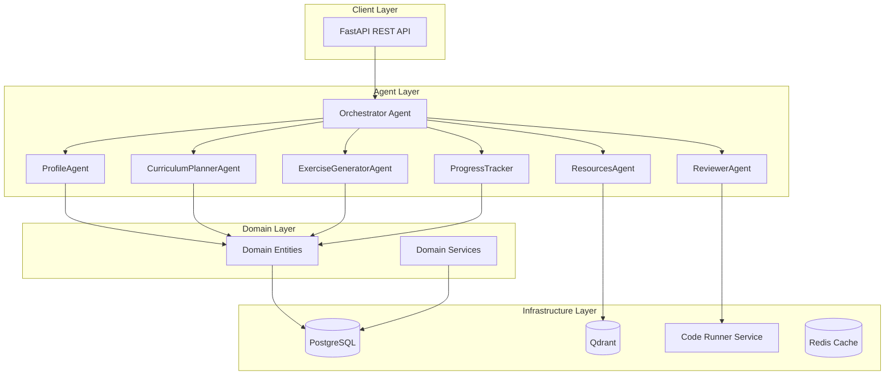

# 🎓 Agentic Learning Coach for Developers

> An intelligent multi-agent system that provides personalized coding education and mentorship for developers.

[]()
[]()
[]()
[]()
[]()

Built with [Kiro CLI](https://kiro.dev) using spec-driven development.

## 📸 Application Screenshots

<div align="center">

### 🏠 Main Dashboard

*Personalized learning dashboard with progress tracking, XP system, and today's tasks*

### 🎯 Interactive Exercises

*Code editor with real-time feedback, test execution, and adaptive hints*

### 🛤️ Learning Path Visualization

*AI-generated curriculum with dependency tracking and progress visualization*

### 🏆 Gamification & Social Features
<table>
<tr>
<td width="50%">


*Achievement system with badges, XP, and streaks*

</td>
<td width="50%">


*Peer challenges and collaborative learning*

</td>
</tr>
</table>

### 📱 Mobile-Responsive Design

*Fully responsive interface optimized for mobile learning*

</div>

## ✨ Key Features

<table>
<tr>
<td width="50%">

### 🧠 **Adaptive Learning**
AI-driven curriculum that adjusts to learner pace and skill level

### 💻 **Practice-First Approach** 
70% hands-on coding exercises with immediate feedback

### 🤖 **Multi-Agent Intelligence**
7 specialized agents for different aspects of learning

</td>
<td width="50%">

### 🔒 **Secure Code Execution**
Sandboxed Docker environment for running untrusted code

### 📊 **Progress Tracking**
Detailed analytics with adaptive difficulty adjustment

### 📚 **Resource Discovery**
Semantic search for relevant learning materials

</td>
</tr>
</table>

### 🎮 Gamification System
- **XP & Levels**: Exponential progression with streak bonuses
- **Achievements**: 15+ categories (streak, skill, milestone)
- **Badges**: Visual rewards with rarity tiers
- **Leaderboards**: Global rankings and peer challenges

### 🤝 Social Learning
- **Peer Challenges**: Speed coding, code golf competitions
- **Solution Sharing**: Code sharing with likes and comments
- **Study Groups**: Collaborative learning with weekly goals
- **Follow System**: Activity feeds from fellow learners

### 🔬 Advanced Analytics
- **AI-Powered Insights**: Difficulty prediction and retention analysis
- **Learning Velocity**: Track progress speed and optimization
- **Knowledge Gaps**: Identify and address weak areas
- **Personalized Recommendations**: AI-suggested next steps

## 🏗️ Architecture

The system follows **clean architecture** principles with a multi-agent design pattern:



### Agent Responsibilities

| Agent | Role | Key Features |
|-------|------|--------------|
| **Orchestrator** | Routes intents, coordinates workflows | Intent classification, error recovery |
| **ProfileAgent** | Manages learner profiles | Skill assessment, goal parsing |
| **CurriculumPlannerAgent** | Designs learning paths | Adaptive difficulty, spaced repetition |
| **ExerciseGeneratorAgent** | Creates practice exercises | Difficulty scaling, hint generation |
| **ReviewerAgent** | Evaluates code submissions | Test execution, feedback generation |
| **ResourcesAgent** | Curates learning materials | Semantic search, quality filtering |
| **ProgressTracker** | Monitors learning progress | Adaptation triggers, analytics |

### Project Structure

```
├── src/
│   ├── domain/           # Core business entities and rules
│   │   ├── entities/     # UserProfile, LearningPlan, Task, etc.
│   │   └── services/     # CodeRunner, SecurityValidator
│   ├── ports/            # Interfaces and abstractions
│   │   ├── repositories/ # Data access interfaces
│   │   └── services/     # External service interfaces
│   ├── adapters/         # External integrations
│   │   ├── api/          # FastAPI routers and models
│   │   ├── database/     # PostgreSQL repositories
│   │   └── services/     # MCP tools, code execution
│   └── agents/           # AI agents and orchestration
│       ├── base/         # BaseAgent, CircuitBreaker
│       └── [agent]/      # Individual agent implementations
├── tests/                # 356 unit & integration tests
├── runner_service/       # Sandboxed code execution
├── .kiro/                # Kiro CLI configuration
│   ├── steering/         # 12 steering documents
│   ├── prompts/          # Custom Kiro prompts
│   └── specs/            # Spec-driven development
└── scripts/              # Utility scripts
```

## 🚀 Quick Start

### ⚡ One-Command Setup

```bash
# Clone and setup everything automatically
git clone <repository-url>
cd agentic-learning-coach

# 🚀 Run automated setup (installs dependencies, starts services)
chmod +x scripts/dev-setup.sh && ./scripts/dev-setup.sh

# 🎯 Start the complete system
make docker-up && make dev-server
```

<div align="center">

**🌐 Visit [localhost:8000/docs](http://localhost:8000/docs) for interactive API documentation**

**🎮 Access the web app at [localhost:3000](http://localhost:3000)**

</div>

### 🛠️ What Gets Started

| Service | Port | Status | Description |
|---------|------|--------|-------------|
| 🎓 **Learning Coach** | 8000 |  | Main API and agent orchestration |
| 🏃 **Code Runner** | 8001 |  | Secure code execution sandbox |
| 🌐 **Web Frontend** | 3000 |  | React-based learning interface |
| 🗄️ **PostgreSQL** | 5432 |  | Primary database |
| 🔍 **Qdrant** | 6333 |  | Vector database for semantic search |
| ⚡ **Redis** | 6379 |  | Caching and sessions |

### Manual Setup

<details>
<summary>Click to expand manual setup instructions</summary>

1. **Create virtual environment:**
   ```bash
   python3.11 -m venv .venv
   source .venv/bin/activate
   ```

2. **Install dependencies:**
   ```bash
   make dev-install
   ```

3. **Configure environment:**
   ```bash
   cp .env.example .env
   # Edit .env with your settings
   ```

4. **Start services:**
   ```bash
   make docker-up
   ```

5. **Run migrations:**
   ```bash
   make migrate
   ```

6. **Start the server:**
   ```bash
   make dev-server
   ```

</details>

## 🔧 Kiro CLI Integration

<div align="center">

**🎯 Built with [Kiro CLI](https://kiro.dev) using spec-driven development**


</div>

This project showcases **comprehensive Kiro CLI integration** with:

### 📋 Steering Documents (12 files)
<details>
<summary><b>🗂️ View all steering documents</b></summary>

Located in `.kiro/steering/` - these guide all development decisions:

| Document | Purpose | Impact |
|----------|---------|---------|
| `00_project_overview.md` | 📖 Project summary and steering index | Foundation |
| `01_architecture_clean_boundaries.md` | 🏗️ System architecture and boundaries | Core Structure |
| `02_coding_standards_solid.md` | ✨ SOLID principles and code quality | Code Quality |
| `03_agent_roles_handoff_protocol.md` | 🤖 Agent responsibilities and communication | Agent Design |
| `04_workflows_intents_routing.md` | 🔄 Intent handling and routing | User Experience |
| `05_tools_mcp_discipline.md` | 🛠️ MCP tool usage patterns | Tool Integration |
| `06_postgres_data_model_migrations.md` | 🗄️ Database design | Data Architecture |
| `07_qdrant_vector_store_rules.md` | 🔍 Vector database patterns | Search & Discovery |
| `08_security_privacy_safety.md` | 🔒 Security requirements | Safety & Privacy |
| `09_observability_logging.md` | 📊 Monitoring and logging | Operations |
| `10_testing_quality_gates.md` | 🧪 Testing strategy | Quality Assurance |
| `11_demo_script_acceptance.md` | ✅ Acceptance criteria | Validation |

</details>

### 🎯 Custom Prompts (6 specialized)
<details>
<summary><b>🤖 View custom Kiro prompts</b></summary>

Located in `.kiro/prompts/` - domain-specific AI assistance:

| Prompt | Purpose | Usage |
|--------|---------|-------|
| **`generate-exercise.md`** | 🏋️ Generate coding exercises with test cases | Exercise creation |
| **`review-submission.md`** | 📝 Review code and provide educational feedback | Code evaluation |
| **`create-curriculum.md`** | 📚 Create personalized learning paths | Curriculum design |
| **`assess-learner.md`** | 🎯 Assess skill level through diagnostics | Skill assessment |
| **`debug-learning-issue.md`** | 🔧 Diagnose and resolve learner struggles | Problem solving |
| **`code-review-hackathon.md`** | 🏆 Hackathon submission review | Quality evaluation |

</details>

### 🔗 Agent Hooks (4 automated workflows)
<details>
<summary><b>⚡ View automation hooks</b></summary>

Located in `.kiro/hooks/` - automated development workflows:

| Hook | Trigger | Action |
|------|---------|--------|
| **`auto-test-generator.md`** | 💾 File save | Generate tests automatically |
| **`learning-path-validator.md`** | 📚 Curriculum changes | Validate learning paths |
| **`code-quality-gate.md`** | 🔄 Pre-commit | Quality enforcement with security scanning |
| **`learning-streak-notifier.md`** | 🎮 Gamification events | Streak notifications and reminders |

</details>

### 📋 Spec-Driven Development
<details>
<summary><b>📖 View development specs</b></summary>

The complete project spec in `.kiro/specs/agentic-learning-coach/`:

```
📁 specs/agentic-learning-coach/
├── 📄 requirements.md   # 11 user stories with acceptance criteria
├── 📄 design.md         # Architecture decisions and diagrams  
└── 📄 tasks.md          # 50+ implementation tasks with status
```

**Spec Highlights:**
- ✅ **11 User Stories** with detailed acceptance criteria
- ✅ **Architecture Decisions** with rationale and diagrams
- ✅ **50+ Implementation Tasks** with completion tracking
- ✅ **Iterative Refinement** documented throughout development

</details>

## 🐳 Services

| Service | Port | Description |
|---------|------|-------------|
| **Coach Service** | 8000 | Main API and agent orchestration |
| **Runner Service** | 8001 | Secure code execution |
| **PostgreSQL** | 5432 | Primary database |
| **Redis** | 6379 | Caching and sessions |
| **Qdrant** | 6333 | Vector database for semantic search |

## 📡 API Endpoints (47+ endpoints)

<div align="center">

**🌐 [Interactive API Documentation](http://localhost:8000/docs) • [Health Dashboard](http://localhost:8000/health/detailed)**

</div>

### 🏥 Health & Monitoring
| Endpoint | Description |
|----------|-------------|
| `GET /health` | Basic health check |
| `GET /health/detailed` | Detailed system health with metrics |
| `GET /health/ready` | Kubernetes readiness probe |
| `GET /health/live` | Kubernetes liveness probe |

### 🎯 Core Learning APIs (25 endpoints)

<details>
<summary><b>🎯 Goals API</b> - Manage learning objectives</summary>

- `POST /api/v1/goals` - Create a new learning goal
- `GET /api/v1/goals` - List all goals for a user  
- `GET /api/v1/goals/{goal_id}` - Get a specific goal
- `PATCH /api/v1/goals/{goal_id}` - Update a goal
- `DELETE /api/v1/goals/{goal_id}` - Delete a goal

</details>

<details>
<summary><b>📚 Curriculum API</b> - Manage learning paths</summary>

- `GET /api/v1/curriculum` - Get active curriculum
- `POST /api/v1/curriculum` - Create new curriculum  
- `GET /api/v1/curriculum/{id}` - Get curriculum details
- `PATCH /api/v1/curriculum/{id}` - Update curriculum
- `DELETE /api/v1/curriculum/{id}` - Delete curriculum

</details>

<details>
<summary><b>📝 Tasks API</b> - Access learning tasks</summary>

- `GET /api/v1/tasks/today` - Get today's tasks
- `GET /api/v1/tasks/{task_id}` - Get specific task
- `GET /api/v1/tasks` - List tasks with filters
- `POST /api/v1/tasks` - Create new task
- `PATCH /api/v1/tasks/{task_id}` - Update task

</details>

<details>
<summary><b>💻 Submissions API</b> - Submit and review code</summary>

- `POST /api/v1/submissions` - Submit code for evaluation
- `GET /api/v1/submissions/{id}` - Get submission details
- `GET /api/v1/submissions` - List user submissions
- `GET /api/v1/submissions/{id}/feedback` - Get detailed feedback

</details>

<details>
<summary><b>📊 Progress API</b> - Track learning progress</summary>

- `GET /api/v1/progress` - Get progress summary
- `GET /api/v1/progress/metrics` - Get detailed metrics
- `GET /api/v1/progress/streak` - Get streak information
- `GET /api/v1/progress/analytics` - Advanced progress analytics

</details>

### 🔬 Advanced APIs (22 endpoints)

<details>
<summary><b>📈 Analytics API</b> - AI-powered learning insights (5 endpoints)</summary>

- `GET /api/v1/analytics/insights` - Comprehensive learning insights
- `GET /api/v1/analytics/difficulty-prediction` - AI-powered difficulty prediction  
- `GET /api/v1/analytics/retention` - Knowledge retention analysis
- `GET /api/v1/analytics/heatmap` - Activity heatmap data
- `GET /api/v1/analytics/recommendations` - Personalized recommendations

</details>

<details>
<summary><b>🎮 Gamification API</b> - XP, achievements, streaks (7 endpoints)</summary>

- `GET /api/v1/gamification/profile` - Get gamification profile
- `GET /api/v1/gamification/achievements` - List achievements
- `GET /api/v1/gamification/badges` - Get earned badges
- `GET /api/v1/gamification/leaderboard` - Global XP rankings
- `GET /api/v1/gamification/streak` - Current streak status
- `POST /api/v1/gamification/xp` - Award XP points
- `GET /api/v1/gamification/level` - Get current level info

</details>

<details>
<summary><b>🤝 Social API</b> - Peer learning and challenges (10 endpoints)</summary>

- `GET /api/v1/social/challenges` - Browse peer challenges
- `POST /api/v1/social/challenges` - Create new challenge
- `GET /api/v1/social/solutions` - View shared solutions
- `POST /api/v1/social/solutions` - Share a solution
- `GET /api/v1/social/groups` - List study groups
- `POST /api/v1/social/groups` - Create study group
- `GET /api/v1/social/feed` - Activity feed
- `POST /api/v1/social/follow` - Follow another learner
- `GET /api/v1/social/leaderboard` - Challenge leaderboard
- `POST /api/v1/social/comments` - Comment on solutions

</details>

## � Development & Testing

### 🧪 Running Tests (356 tests, 90%+ coverage)

```bash
# 🚀 Run all tests with coverage
make test

# 📊 Generate detailed coverage report  
pytest tests/ --cov=src --cov-report=html

# 🎯 Run specific test categories
pytest tests/unit/agents/ -v          # Agent tests
pytest tests/integration/ -v          # Integration tests  
pytest tests/property/ -v             # Property-based tests
```

### ✨ Code Quality & Standards

```bash
make format    # 🎨 Format code with black
make lint      # 🔍 Run linting checks (flake8, mypy)
make type-check # 🏷️ Type checking with mypy
make security  # 🔒 Security scanning
```

### 🗄️ Database Operations

```bash
make migrate                           # ⬆️ Run migrations
make migrate-create name="add_table"   # 📝 Create new migration
make migrate-downgrade                 # ⬇️ Rollback migration
make db-seed                          # 🌱 Seed with sample data
```

### 🐳 Docker Operations

```bash
make docker-up      # 🚀 Start all services
make docker-down    # 🛑 Stop all services  
make docker-logs    # 📋 View service logs
make docker-clean   # 🧹 Clean up containers and volumes
```

## ⚙️ Configuration

### 🔧 Environment Setup

```bash
# Copy example configuration
cp .env.example .env

# Edit with your settings
nano .env
```

### 📋 Configuration Variables

| Variable | Description | Default | Required |
|----------|-------------|---------|----------|
| `DATABASE_URL` | PostgreSQL connection string | `postgresql://...` | ✅ |
| `REDIS_URL` | Redis connection string | `redis://localhost:6379` | ✅ |
| `QDRANT_URL` | Qdrant vector database URL | `http://localhost:6333` | ✅ |
| `SECRET_KEY` | Application secret key | (generate secure key) | ✅ |
| `LOG_LEVEL` | Logging verbosity | `INFO` | ❌ |
| `OPENAI_API_KEY` | OpenAI API key for LLM features | (your key) | ❌ |
| `ANTHROPIC_API_KEY` | Anthropic API key for LLM features | (your key) | ❌ |

### 🔐 Security Configuration

```bash
# Generate secure secret key
python -c "import secrets; print(secrets.token_urlsafe(32))"

# Set up API keys for LLM features (optional)
export OPENAI_API_KEY="your-openai-key"
export ANTHROPIC_API_KEY="your-anthropic-key"
```

## 🤝 Contributing

<div align="center">

**🎯 We welcome contributions! Follow our spec-driven development approach.**


</div>

### 🚀 Quick Contribution Guide

1. **🍴 Fork** the repository
2. **🌿 Create** a feature branch: `git checkout -b feature/amazing-feature`
3. **📋 Follow** the steering documents in `.kiro/steering/`
4. **🧪 Write tests** (maintain 90%+ coverage)
5. **✅ Run quality checks**: `make lint && make test`
6. **💬 Commit** with clear message: `git commit -m 'Add amazing feature'`
7. **🚀 Push** and open a Pull Request

### 📋 Development Standards

- ✅ **Follow SOLID principles** (see `02_coding_standards_solid.md`)
- ✅ **Write comprehensive tests** (unit + integration + property-based)
- ✅ **Document your changes** (inline comments + README updates)
- ✅ **Use type hints** (strict TypeScript/Python typing)
- ✅ **Follow agent protocols** (see `03_agent_roles_handoff_protocol.md`)

### 🎯 Areas for Contribution

- 🤖 **New Agents**: Specialized learning agents
- 🎮 **Gamification**: Achievement systems and challenges  
- 📊 **Analytics**: Learning insights and visualizations
- 🔧 **Tools**: Developer productivity enhancements
- 📚 **Content**: Learning exercises and curricula
- 🌐 **Frontend**: UI/UX improvements

## 📄 License

MIT License - see [LICENSE](LICENSE) for details.

## 🔗 Links & Resources

<div align="center">

| Resource | Link | Description |
|----------|------|-------------|
| 🌐 **Live Demo** | [localhost:3000](http://localhost:3000) | Web application (when running) |
| 📚 **API Docs** | [localhost:8000/docs](http://localhost:8000/docs) | Interactive API documentation |
| 🏥 **Health Dashboard** | [localhost:8000/health/detailed](http://localhost:8000/health/detailed) | System health monitoring |
| 🎯 **Kiro CLI** | [kiro.dev](https://kiro.dev) | Spec-driven development platform |
| 📖 **Documentation** | [docs/](docs/) | Additional documentation |

</div>

---

<div align="center">

**🎓 Built with ❤️ using [Kiro CLI](https://kiro.dev) spec-driven development**


**⭐ Star this repo if it helped you learn something new!**

</div>