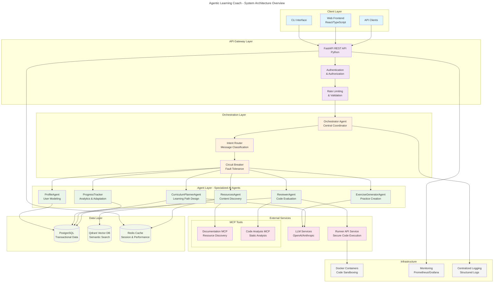
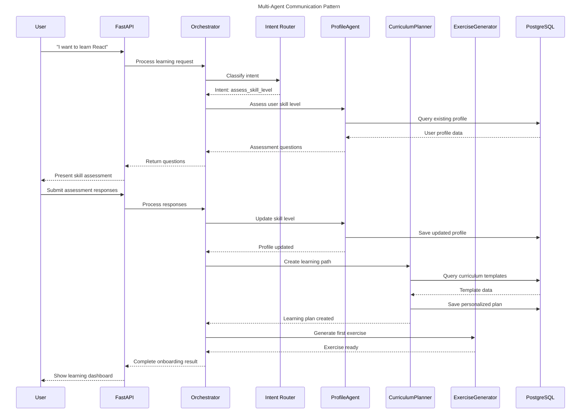
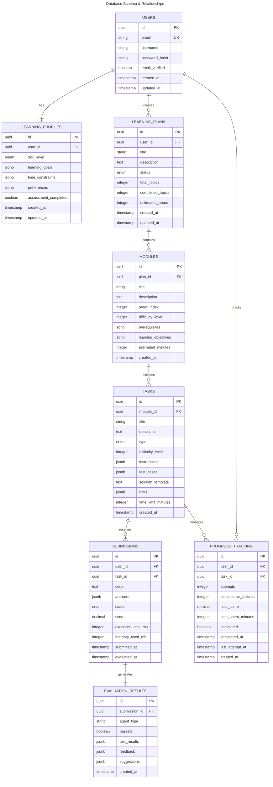
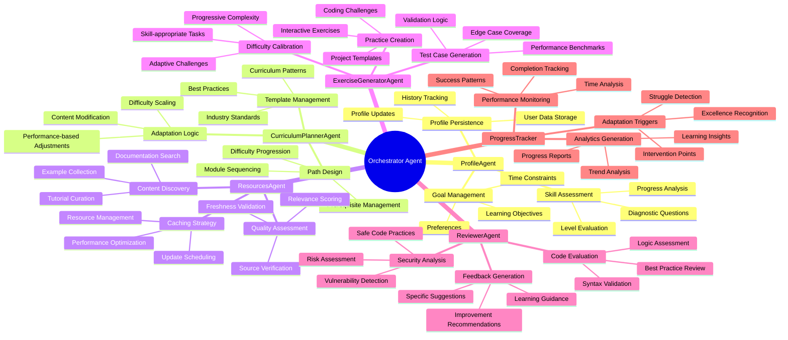
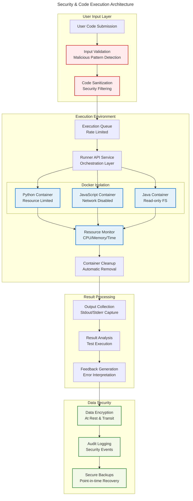
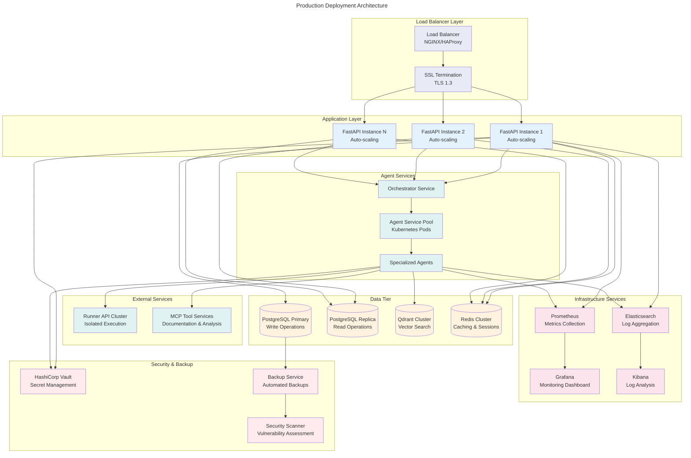

# Agentic Learning Coach - System Architecture

This document provides a comprehensive architectural overview of the Agentic Learning Coach system using Mermaid diagrams.

## High-Level System Architecture

## Agent Communication Flow

## Data Architecture & Relationships

## Agent Specialization & Responsibilities

## Security & Isolation Architecture

## Deployment Architecture

## Key Architectural Principles

### 1. **Clean Architecture Boundaries**
- Clear separation between agents, data access, and external services
- Dependency inversion with repository patterns
- Interface-based communication between components

### 2. **Multi-Agent Orchestration**
- Hub-and-spoke pattern with centralized coordination
- Specialized agents with single responsibilities
- Circuit breaker pattern for fault tolerance

### 3. **Security-First Design**
- Sandboxed code execution in isolated containers
- Input validation and sanitization at all entry points
- Comprehensive audit logging and monitoring

### 4. **Scalable Data Architecture**
- PostgreSQL for transactional data with ACID guarantees
- Qdrant for semantic search and resource discovery
- Redis for caching and session management

### 5. **Observability & Monitoring**
- Structured logging with correlation IDs
- Comprehensive metrics collection
- Real-time monitoring and alerting

This architecture provides a robust, scalable, and secure foundation for the Agentic Learning Coach system, enabling personalized learning experiences while maintaining high performance and reliability.